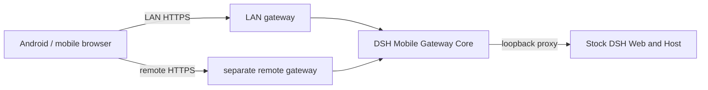

<p align="center">
  
</p>

<h1 align="center">DSH Mobile</h1>

<p align="center">Secure, live LAN access to DeepSeek Harness from a phone.</p>

<p align="center">
  <a href="https://www.npmjs.com/package/dsh-mobile"></a>
  <a href="https://www.npmjs.com/package/dsh-mobile"></a>
  <a href="https://github.com/saya-ch/dsh-mobile/actions/workflows/ci.yml"></a>
  <a href="https://github.com/saya-ch/dsh-mobile/releases"></a>
  <a href="LICENSE"></a>
  <a href="https://github.com/awesome-dsh-plugin/awesome-dsh-plugin"></a>
</p>

<p align="center"><a href="README.md">简体中文</a> · <a href="CHANGELOG.md">Changelog</a></p>

> DSH Mobile is a DeepSeek Harness community plugin; the native app supports Android only.
>
> **0.3.8 update**: thanks to @StrawberryAO for the WeChat Mini-Program compatibility fix covering its automatic `Sec-Fetch-Site` and comma-joined Origin headers. The gateway also follows the active DSH WebServer port and rejects mixed untrusted Origins. [Details](CHANGELOG.md).
>
> **Upgrade reminder**: Windows DSH Desktop users should update to plugin 0.3.8. Existing 0.3.3-0.3.7 apps and paired devices remain compatible without re-pairing. [Compatibility notes](#compatibility).

<p align="center">
  <a href="https://github.com/saya-ch/dsh-mobile/releases/download/v0.3.8/dsh-mobile-android-v0.3.8.apk"></a><br>
  <a href="https://github.com/saya-ch/dsh-mobile/releases/download/v0.3.8/dsh-mobile-android-v0.3.8.apk"><strong>Download Android app 0.3.8</strong></a><br>
  <sub><a href="https://github.com/saya-ch/dsh-mobile/releases/tag/v0.3.8">Release notes and checksums</a></sub>
</p>

DSH Mobile is a DeepSeek Harness plugin that lets a mobile browser or the Android app connect over a protected LAN or an optional Tailscale Funnel, cpolar, or self-hosted FRP remote path. Local and remote access keep the same sessions, Workspaces, messages, and tools while using separate switches and paired-device stores without modifying DeepSeek Harness source.

Mobile access runs on its own HTTPS origin with pinned certificates; only paired devices pass validation.

It also lets you customize the phone from a DSH conversation: `/mobile <what you want>`.

## What it does

- **Continue DSH work from a phone**: the same sessions, Workspaces, messages, and tools, in real time.
- **Customize the phone UI by talking to DSH**: change the mobile layout, interactions, and features from a conversation; open pages refresh within seconds.
- **A dedicated touch layout**: session drawer, tool details, settings, question cards, and composer reorganized for phones. Native app screens follow the Android system locale in Simplified Chinese, English, or Italian. Plugin-owned Web UI follows DSH's selected locale; Italian resources are ready for a future DSH Italian locale.
- **Image attachments**: use the top row of the composer plus menu to select an image or take a photo; PNG, JPEG, WebP, and GIF files up to 8 MiB are supported, plus full-resolution JPEG capture.
- **Auto-discovery, no re-pairing**: Wi-Fi, hotspot, or IP changes normally recover automatically.
- **One-click connection diagnostics**: check versions, gateway, network interface, firewall, and the remote path; stable reason codes are localized in the UI, and the copied report excludes credentials and complete addresses.
- **Faster reconnection**: trusted connections race during restore, revisioned assets are reused, and mobile boot batches are compressed.
- **Three pairing options**: scan a QR code, paste a pairing link, or enter a key.

A paired device is fully trusted and can operate the DSH on the computer. Use this only on a trusted home or office LAN, or a trusted VPN.

## Quick start

With an installed `dsh` command:

```powershell
dsh plugin --profile web add dsh-mobile@latest
dsh plugin --profile web exec dsh-mobile setup
dsh --profile web
```

From a DeepSeek Harness source checkout:

```powershell
corepack enable; pnpm install
pnpm dsh plugin --profile web add dsh-mobile@latest
pnpm dsh plugin --profile web exec dsh-mobile setup
pnpm dsh --profile web
```

Or via the plugin market (optional):

```powershell
dsh plugin --profile web add dshmarket
```

Restart DSH, then search for **dsh-mobile** under **Settings → Plugin Market** and install it with one click.

`setup` automatically selects and remembers the current LAN; Wi-Fi, hotspot, and IP changes normally recover without re-pairing. Use `--address 192.168.x.x` only when automatic selection fails. Settings, certificates, devices, and customization files live under `$DSH_HOME/mobile-access/`.

After installation, start DSH and use the connection guide below to choose LAN or remote access.

Registry-installed plugins check for updates when the desktop UI loads and show “Update plugin” beside the access-panel title when a newer release is available. Restart DSH after installation. The app download entry shows the latest version; local development packages are not overwritten, and Android does not send update notifications.

## Connection guide

LAN and remote access are independent connections. Prefer LAN while the phone is near the computer for the lowest latency, and enable remote access only when leaving that network. Each path keeps its own switch, paired devices, and sign-in state.

### Local network

Use this when the phone and computer share Wi-Fi, Ethernet, or a phone hotspot. It is the default and simplest path.

<p align="center">
  
</p>

1. Connect the phone and computer to the same local network, then open **Mobile Access → Local network** in the lower-left corner of DeepSeek Harness.
2. If needed, select **Enable local access**, then select **Create and copy key**. The panel displays a pairing QR code.
3. In the Android app, open **Local network**, scan for computers, select the device, then scan the QR code or paste the pairing key.
4. Pairing creates persistent device trust. Later app launches discover and connect automatically; Wi-Fi, hotspot, and DHCP address changes normally do not require pairing again.

The app is optional: select **Copy pairing link** and open it in a mobile browser. The browser must manually trust the plugin certificate on the first visit.

### Remote access

Use this after the phone leaves the computer's network. Remote access is disabled by default, and the phone needs no separate Tailscale, cpolar, or FRP app.

Remote providers may impose bandwidth and connection limits: the [cpolar Free plan](https://svip.cpolar.com/pricing) currently lists 1 Mbps, while [Tailscale Funnel](https://tailscale.com/docs/features/tailscale-funnel#requirements-and-limitations) has non-configurable bandwidth limits. DSH Mobile reduces transfer and waiting with 10-message pages, load-on-scroll history, gzip, and a persistent WebSocket, but it cannot raise provider quotas.

<p align="center">
  
</p>

1. Open **Mobile Access → Remote** in the lower-left corner of DeepSeek Harness and choose a provider:
   - **Tailscale Funnel**: select **Enable remote access**, complete the one-time Tailscale sign-in on the official page, follow the panel prompt to allow Funnel, then return to DSH and wait until the connection is ready.
   - **cpolar**: select **Install official component**, sign in to the cpolar dashboard and obtain an Authtoken, paste it, then select **Save and connect**. The component is downloaded into the plugin's private directory only after confirmation.
   - **Self-hosted FRP (advanced)**: expand **Self-hosted connection**, enter the VPS, frps port, shared token, and public HTTPS origin. The origin may use your domain or the VPS public IPv4 address (for example, `https://203.0.113.10` — substitute your own real address; documentation ranges are rejected). Apply the restricted template manually or enter an SSH user, port, and local private-key path for automatic deployment. Automatic deployment supports Ubuntu/Debian with systemd, uses OpenSSH keys or an agent, refuses password auth, and does not overwrite Caddy configuration it does not manage; both deployment and server cleanup display the SSH host keys for verification against the VPS console before continuing. IPv4 mode obtains a roughly six-day Let's Encrypt IP certificate and installs daily automatic renewal. Install the official `frpc` on demand and verify the path afterward. A reviewable uninstall script or one-click server cleanup removes only DSH Mobile-owned services and configs. This requires Android app 0.3.3 or later.
2. When the panel reports that remote access is ready, select **Create remote pairing QR code**.
3. In the Android app, open **Remote access** and scan the QR code to create its separate pairing.
4. The app keeps device trust and reconnects automatically. Disable remote access when it is not needed; LAN access remains unchanged.

Tailscale Funnel has broad reach but may be unreliable from mainland China. Its runtime ties the public listener to the parent process and a bounded control channel; parent exit, channel closure, or an explicit stop ends the current generation and cleans up its resources. cpolar is better suited to mainland networks, while self-hosted FRP fits users who already have a VPS and want to avoid public-provider bandwidth quotas. An unregistered domain on a mainland-China VPS may be intercepted by the cloud provider; public IPv4 mode avoids that dependency. The plugin validates pinned on-demand components, stores their configuration and programs entirely under `$DSH_HOME/mobile-access/`, and can remove them completely from the panel.

Self-hosted FRP generates only one HTTP vhost to the DSH loopback gateway. It exposes no arbitrary FRP configuration, TCP/UDP proxy, or FRP plugin. The VPS plaintext vhost must bind to `127.0.0.1`, with Caddy providing public HTTPS; the plugin rejects a publicly reachable plaintext port and reports readiness only after public discovery identifies the current computer.

The public remote origin still requires DSH device pairing. The bundled Funnel and managed cpolar components currently support Windows x64; on-demand FRP 0.70.1 supports Windows, Linux, and macOS on x64 and arm64.

## Extend and customize

Type `/mobile <what you want>` in a DSH conversation, and DSH edits the phone client's files for you; changes apply within a few seconds. For example:

```text
/mobile turn the phone UI into an old CRT terminal, with messages scrolling like terminal output
```

It can also drive computer capabilities the phone can use, like reading the machine's live state:

```text
/mobile give the phone a cyberpunk-style computer monitor panel that shows live CPU, memory, and disk usage
```

Two kinds of changes are supported: the phone UI itself (theme, layout, buttons), and computer capabilities the phone can use (browsing computer files, running programs on the computer). `/mobile` hands the request to the DSH agent, which edits files under the local DSH configuration directory (`$DSH_HOME/mobile-access/`); the phone client applies them automatically. UI changes live in `mobile.css`/`mobile.js`. Computer capabilities come from extensions under `extensions/`, whose `host.mjs` runs with the local user's privileges on the computer. DeepSeek Harness source is not modified.

Extension manifests, scripts, styles, and assets are revisioned. When the plugin observes a `/mobile` or extension-file change, it notifies authenticated phones to refresh immediately; 45-second visible and 5-minute hidden checks remain only as recovery fallbacks. A failed Host staging pass keeps the current version; if the Host has changed but the new phone UI cannot activate, that extension closes and retries instead of mixing generations.

<sub>You can even use an extension to connect to SillyTavern running on the same computer, give it a lightweight mobile frontend, and open it from the same app.</sub>

> `host.mjs` has the same privileges as a local program. Create and run only computer-side extensions that you understand and trust.

The examples above, applied:

<p align="center">
  
  
  
  
</p>

## App or mobile browser

| Client | Best for | Notes |
| --- | --- | --- |
| Android app | Everyday use | Separate Local and Remote entries; LAN discovery and a system-trusted remote HTTPS path |
| Mobile browser | Temporary or cross-platform | Open the HTTPS origin shown by Mobile Access; trust the certificate manually on first visit |

The Android app is a thin Kotlin WebView shell and contains no frontend copy; mobile browsers load the same page. For compatibility diagnosis, append `?frontend=stock` to the browser URL to temporarily use the previous desktop-page adaptation.

## How it works



Three layers: the Host face for discovery, pairing, HTTPS, loopback proxying, and extension registration; the Client face for the dedicated mobile layout and extension SDK; and the Android app for a narrow native bridge. The bridge uses `androidx.webkit` WebMessage, verifies the exact top-level origin and main frame on every bounded message, and never uses `addJavascriptInterface`. Neither the DeepSeek Harness source nor its desktop page on port 3080 is modified.

## Security

- Use the LAN listener only on a trusted home, office, or hotspot network; do not add your own port forwarding.
- A remote origin is publicly reachable, but unpaired requests cannot enter DSH; turn the remote switch off when it is not needed.
- cpolar downloads a pinned official build only after confirmation and verifies its size and SHA-256. It installs no system service, PATH entry, or startup task, and plugin cleanup removes its managed files.
- Self-hosted FRP downloads pinned official `frpc` only after confirmation and verifies the origin, exact size, SHA-256, archive paths, and executable version. The shared token never appears in status, diagnostics, or logs. Copying the server template places it on the system clipboard, so clear the clipboard after use; local cleanup removes only plugin-managed files, while the VPS is cleaned separately with the uninstall script or one-click server cleanup. Automatic deployment and server cleanup both display the SSH host keys, which must be verified against the VPS console before continuing.
- A paired device is a fully trusted DeepSeek Harness operator and can run tools on the computer; revoke lost devices from the computer.
- The LAN gateway listens only while Mobile Access is enabled; with it off, DSH keeps running normally on the computer.

See [SECURITY.md](SECURITY.md).

## Compatibility

The table below lists, for each plugin version, the DeepSeek Harness version it is verified to support (earlier 0.1.x releases are compatible as well). Starting with 0.3.6 the plugin no longer rejects a DSH version by number alone; newer unlisted versions are covered by CI's contract checks. History lives in [CHANGELOG.md](CHANGELOG.md).

| DSH Mobile plugin | Verified DeepSeek Harness version |
| --- | --- |
| `0.3.6`-`0.3.8` | `0.1.2-rc.1` |
| `0.3.4`, `0.3.5` | `0.1.2-alpha.2` |
| `0.3.0`-`0.3.3` | `0.1.2-alpha.1` |
| `0.1.4`, `0.2.x` | `0.1.1-rc.2` |

Existing 0.3.3-0.3.7 apps do not need re-pairing. Earlier apps use a different status-bar strategy, so updating both is recommended. App 0.1.3 or earlier requires reinstalling and pairing again.

## Uninstall

```powershell
dsh plugin --profile web remove dsh-mobile
```

To remove local plugin data first:

```powershell
dsh plugin --profile web exec dsh-mobile purge --yes
dsh plugin --profile web remove dsh-mobile
```

Source users replace `dsh` with `pnpm dsh`.

## Development

```powershell
npm ci
npm run verify
```

See the [Android guide](apps/mobile/README.md). Licensed under [Apache-2.0](LICENSE).
