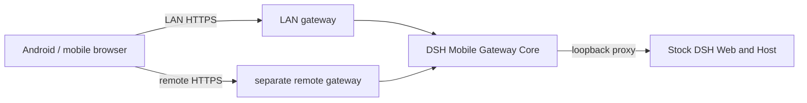

<p align="center">
  
</p>

<h1 align="center">DSH Mobile</h1>

<p align="center">Secure, live access to DeepSeek Harness from a phone.</p>

<p align="center">
  <a href="https://www.npmjs.com/package/dsh-mobile"></a>
  <a href="https://www.npmjs.com/package/dsh-mobile"></a>
  <a href="https://github.com/saya-ch/dsh-mobile/actions/workflows/ci.yml"></a>
  <a href="https://github.com/saya-ch/dsh-mobile/releases"></a>
  <a href="LICENSE"></a>
  <a href="https://github.com/awesome-dsh-plugin/awesome-dsh-plugin"></a>
</p>

<p align="center">
  <a href="#what-it-does">What it does</a> ·
  <a href="#quick-start">Quick start</a> ·
  <a href="#connection-guide">Connection guide</a> ·
  <a href="#extend-and-customize">Extend and customize</a> ·
  <a href="#device-management">Device management</a> ·
  <a href="#third-party-plugin-compatibility">Third-party plugins</a> ·
  <a href="#security">Security</a> ·
  <a href="#compatibility">Compatibility</a> ·
  <a href="#contributors">Contributors</a> ·
  <a href="CHANGELOG.md">Changelog</a> ·
  <a href="README.md">简体中文</a>
</p>

> DSH Mobile is a DeepSeek Harness community plugin; the native app supports Android only.
>
> **Current version: 0.4.7**. It supports DSH `0.1.7-rc.2`, avoids duplicate mobile boot downloads, and improves Android recovery, the phone-width sidebar, and input handling. [Release notes](CHANGELOG.md#047---2026-09-25).
>
> **Upgrade reminder**: update both the plugin and Android app to 0.4.7 when practical. Existing pairings remain intact. The self-signed FRP entry requires at least the 0.4.6 app; older apps can still use existing LAN and trusted-certificate remote connections. [Compatibility notes](#compatibility).

<p align="center">
  <a href="https://github.com/saya-ch/dsh-mobile/releases/download/v0.4.7/dsh-mobile-android-v0.4.7.apk"></a><br>
  <a href="https://github.com/saya-ch/dsh-mobile/releases/download/v0.4.7/dsh-mobile-android-v0.4.7.apk"><strong>Download Android app 0.4.7</strong></a><br>
  <sub><a href="https://github.com/saya-ch/dsh-mobile/releases/tag/v0.4.7">Release notes and checksums</a></sub>
</p>

DSH Mobile is a DeepSeek Harness plugin that lets a mobile browser or the Android app connect over a protected LAN or an optional Tailscale Funnel, cpolar, cloudflared, self-hosted FRP, or own reverse-proxy remote path. Local and remote access keep the same sessions, Workspaces, messages, and tools while using separate switches and paired-device stores without modifying DeepSeek Harness source.

Mobile access uses a dedicated HTTPS origin and device pairing. The Android app pins the private LAN CA; public remote paths use platform-trusted certificates. The self-signed FRP entry additionally requires the 0.4.6 app to pin a remote CA during pairing.

It also lets you customize the phone from a DSH conversation: `/mobile <what you want>`.

## What it does

- **Continue DSH work from a phone**: the same sessions, Workspaces, messages, and tools, in real time.
- **Customize the phone UI by talking to DSH**: change the mobile layout, interactions, and features from a conversation; open pages refresh within seconds.
- **A dedicated touch layout**: session drawer, tool details, settings, question cards, and composer reorganized for phones; the app follows the system locale (Chinese/English/Italian), plugin UI follows DSH's locale.
- **Every remote path covered**: Tailscale, cpolar, cloudflared quick/named tunnels, self-hosted FRP, or your own reverse proxy.
- **Pairing and multi-device**: pair once via QR code, link, or key; Wi-Fi, hotspot, or IP changes normally recover automatically; the app shows all paired computers together in one device list (LAN and every remote), each with live reachability — switch, re-pair, or delete in one tap.
- **One-click diagnostics and approval**: check versions, gateway, network interface, firewall, and the remote path with a redacted report; approve blocked third-party plugin connections per exact path.
- **Task system notifications**: completion and pending-input alerts via Android system notifications, enabled from DSH General settings inside the app, with redacted lock-screen text.
- **Defense in depth**: a private CA pinned for LAN, trusted HTTPS for public remote paths, and a remote CA pinned by the 0.4.6 app for the self-signed FRP entry. Credentials are Keystore-backed, device tokens go only to their exact Origin, and third-party WebSockets are blocked by default.

A paired device is fully trusted and can operate the DSH on the computer. Use this only on a trusted home or office LAN, or a trusted VPN.

## Quick start

With an installed `dsh` command:

```powershell
dsh plugin --profile web add dsh-mobile@latest
dsh plugin --profile web exec dsh-mobile setup
dsh --profile web
```

From a DeepSeek Harness source checkout:

```powershell
corepack enable; pnpm install
pnpm dsh plugin --profile web add dsh-mobile@latest
pnpm dsh plugin --profile web exec dsh-mobile setup
pnpm dsh --profile web
```

Or via the plugin market (optional):

```powershell
dsh plugin --profile web add dshmarket
```

Restart DSH, then search for **dsh-mobile** under **Settings → Plugin Market** and install it. On first opening Mobile access, the Local network page lists this computer's current networks; confirm one to create private certificates and LAN configuration, then restart DSH once as prompted. No terminal `setup` command is required for this path.

`setup` automatically selects and remembers the current LAN; Wi-Fi, hotspot, and IP changes normally recover without re-pairing. Use `--address 192.168.x.x` only when automatic selection fails. Settings, certificates, devices, and customization files live under `$DSH_HOME/mobile-access/`.

After installation, start DSH and use the connection guide below to choose LAN or remote access.

Registry-installed plugins check for updates when the desktop UI loads and show “Update plugin” beside the access-panel title when a newer release is available. Restart DSH after installation. The app download entry shows the latest version; local development packages are not overwritten, and Android does not check for or push app-version updates.

## Connection guide

LAN and remote access are independent connections. Prefer LAN while the phone is near the computer for the lowest latency, and enable remote access only when leaving that network. Each path keeps its own switch, paired devices, and sign-in state.

### Local network

Use this when the phone and computer share Wi-Fi, Ethernet, or a phone hotspot. It is the default and simplest path.

<p align="center">
  
</p>

1. Connect the phone and computer to the same local network, then open **Mobile Access → Local network** in the lower-left corner of DeepSeek Harness.
2. If needed, select **Enable local access**, then select **Create and copy key**. The panel displays a pairing QR code.
3. In the Android app, open **Local network**, scan for computers, select the device, then scan the QR code or paste the pairing key.
4. Pairing creates persistent device trust. Later app launches discover and connect automatically; Wi-Fi, hotspot, and DHCP address changes normally do not require pairing again.

Port note: `dsh web --port` changes the DSH Web upstream port (3080 by default), which the plugin follows automatically. `dsh-mobile setup --port` changes the Mobile HTTPS listener (3443 by default), and the pairing QR code includes the selected port.

Headless Linux hosts, and browsers that open DSH Web through a LAN IP or reverse proxy, can use the same **Mobile access** control in the lower-left corner. The admin API still requires a loopback TCP peer (for example a local `socat` or reverse proxy to `127.0.0.1`) so the plugin itself is not LAN-exposed. The browser Host may be `localhost`, RFC1918, or an IPv4 link-local address; public IPs and arbitrary DNS names still return 403. The reverse proxy must be limited to trusted local or LAN callers and must not publicly forward `/api/mobile-access`. The dedicated Mobile HTTPS listener (3443 by default) remains the phone surface and does not become the desktop admin panel.

The app is optional: select **Copy pairing link** and open it in a mobile browser. The browser must manually trust the plugin certificate on the first visit.

Browser pairing and reauthentication pages use the browser's `Accept-Language` to show Simplified Chinese, English, or Italian. Android screens follow the system language, while the DSH plugin control panel follows the language selected by DSH.

### Remote access

Use this after the phone leaves the computer's network. Remote access is disabled by default, and the phone needs no separate Tailscale, cpolar, cloudflared, or FRP app.

Remote providers may impose bandwidth and connection limits: the [cpolar Free plan](https://svip.cpolar.com/pricing) currently lists 1 Mbps, while [Tailscale Funnel](https://tailscale.com/docs/features/tailscale-funnel#requirements-and-limitations) has non-configurable bandwidth limits, and a cloudflared quick tunnel is a free Cloudflare address with randomized hostnames and rate limiting. DSH Mobile reduces transfer and waiting with 10-message pages, load-on-scroll history, gzip, and a persistent WebSocket, but it cannot raise provider quotas.

<p align="center">
  
</p>

1. Open **Mobile Access → Remote** in the lower-left corner of DeepSeek Harness and choose a provider:
   - **Tailscale Funnel**: select **Enable remote access**, complete the one-time Tailscale sign-in on the official page, follow the panel prompt to allow Funnel, then return to DSH and wait until the connection is ready.
   - **cpolar**: select **Install official component**, sign in to the cpolar dashboard and obtain an Authtoken, paste it, then select **Save and connect**. The component is downloaded into the plugin's private directory only after confirmation; free temporary addresses may change after DSH or cpolar restarts.
   - **Self-hosted FRP (advanced)**: expand **Self-hosted connection**, enter the VPS, frps port, shared token, and public HTTPS origin. The origin may use your domain or the VPS public IPv4 address (for example, `https://203.0.113.10` — substitute your own real address; documentation ranges are rejected). Apply the restricted template manually or enter an SSH user, port, and local private-key path for automatic deployment. Automatic deployment supports Ubuntu/Debian with systemd, uses OpenSSH keys or an agent, refuses password auth, and does not overwrite Caddy configuration it does not manage; both deployment and server cleanup display the SSH host keys for verification against the VPS console before continuing. IPv4 mode obtains a roughly six-day Let's Encrypt IP certificate and installs daily automatic renewal. Install the official `frpc` on demand and verify the path afterward. A reviewable uninstall script or one-click server cleanup removes only DSH Mobile-owned services and configs. This requires Android app 0.3.3 or later. See the [English self-hosted FRP guide](docs/SELF_HOSTED_FRP.en.md) for the complete procedure.
   - **Own reverse proxy**: open **Self-hosted connection → Own reverse proxy**, enter the public HTTPS origin (custom ports supported), private listen IPv4, separate HTTP backend port (default 3444), and allowed proxy source CIDRs, then select **Save and start backend**. This uses your existing Lucky/Nginx/Caddy without a tunnel component and requires Android app 0.4.0 or later. See the [own reverse proxy guide](docs/SELF_HOSTED_ORIGIN.en.md).
   - **cloudflared quick tunnel**: select **Install official component**. After you confirm, the plugin downloads a pinned build from the official release page into its private directory and requests a temporary public address (a quick tunnel) with **no sign-up or sign-in**. Choose this when you would rather not create an account. The quick-tunnel hostname changes on every reconnect, and Cloudflare positions quick tunnels for testing: they are rate-limited and carry no uptime guarantee, so do not rely on one for production access that must stay reachable; it suits temporary or verification use.
   - **cloudflared named tunnel**: with a Cloudflare account and domain, switch **Tunnel type** to **Named**, then supply a connector token, a public hostname and a local forward port to get an address that survives restarts. The token is stored only in the private directory and reaches cloudflared through the environment rather than the command line; see [Cloudflare named tunnel](docs/CLOUDFLARE_TUNNEL.en.md).
2. When the panel reports that remote access is ready, select **Create remote pairing QR code**. Own reverse proxy reports only **Backend listening**: public HTTPS, its certificate and WebSocket still require verification from your phone.
3. In the Android app, open **Remote access** and scan the QR code to create its separate pairing.
4. The app saves the current address and device credential for automatic reconnection. If a free cpolar address changes, scan the computer's current remote QR code to verify the connection again; clearing app data is unnecessary. A stored device token is sent only to its exact saved Origin, never to a new QR-code domain.

> **Remote notifications**: browser `Notification` permission is granted per Origin, and a web-page system toast appears only on the device running that page. Android task reminders are a separate 0.4.0 feature: enable them from the app's foreground menu, and keep the WebView page alive; they are not a general background push service. For reliable background delivery, use a server-side webhook or bot channel you have configured.

Tailscale Funnel has broad reach but may be unreliable from mainland China. Its runtime ties the public listener to the parent process and a bounded control channel; parent exit, channel closure, or an explicit stop ends the current generation and cleans up its resources. cpolar is better suited to mainland networks, while self-hosted FRP fits users who already have a VPS and want to avoid public-provider bandwidth quotas. cloudflared runs in two modes: a quick tunnel needs no account or sign-in, but its hostname is random, changes on every reconnect, and is positioned by Cloudflare for testing with no uptime guarantee, so it suits temporary or verification use rather than a permanent channel; a named tunnel uses a Cloudflare account token and keeps one fixed public hostname across restarts. An unregistered domain on a mainland-China VPS may be intercepted by the cloud provider; public IPv4 mode avoids that dependency. The plugin validates pinned on-demand components, stores their configuration and programs entirely under `$DSH_HOME/mobile-access/`, and can remove them completely from the panel.

Managed self-hosted FRP uses an HTTP vhost to the DSH loopback gateway. Its plaintext VPS listener must be loopback-only, with Caddy providing public HTTPS. Version 0.4.6 adds existing-frps attachment without installing or changing the server: its public-CA mode still needs a restricted HTTP vhost and Caddy, while its self-signed mode forwards raw TCP to a computer-side HTTPS gateway whose CA the 0.4.6 Android app pins during pairing. The self-signed mode currently uses public IPv4 and is unavailable to older apps. Neither mode exposes arbitrary FRP configuration. Because frps `proxyBindAddr` governs proxy listeners globally, do not change it for the new TCP entry without checking existing plaintext vhosts. See the [attachment guide](docs/ATTACH_EXISTING_FRPS.en.md).

The own-proxy HTTP backend must remain on a trusted private network: **never port-forward it publicly or bypass it by proxying to DSH or the existing LAN 3443 gateway**. CIDRs match the proxy's direct TCP peer, not forwarded headers. Preserve the external Host (including port), Origin, cookies and WebSocket. Clearing proxy settings keeps paired remote devices.

The public remote origin still requires DSH device pairing. The bundled Funnel and the managed cpolar and cloudflared components support Windows x64 and Linux x64/arm64; on-demand FRP 0.70.1 supports Windows, Linux, and macOS on x64 and arm64. See [Compatibility](#compatibility) for the per-channel OS matrix.

## Extend and customize

Type `/mobile <what you want>` in a DSH conversation, and DSH edits the phone client's files for you; changes apply within a few seconds. For example:

```text
/mobile turn the phone UI into an old CRT terminal, with messages scrolling like terminal output
```

It can also drive computer capabilities the phone can use, like reading the machine's live state:

```text
/mobile give the phone a cyberpunk-style computer monitor panel that shows live CPU, memory, and disk usage
```

Two kinds of changes are supported: the phone UI itself (theme, layout, buttons), and computer capabilities the phone can use (browsing computer files, running programs on the computer). `/mobile` hands the request to the DSH agent, which edits files under the local DSH configuration directory (`$DSH_HOME/mobile-access/`); the phone client applies them automatically. UI changes live in `mobile.css`/`mobile.js`. Computer capabilities come from extensions under `extensions/`, whose `host.mjs` runs with the local user's privileges on the computer. DeepSeek Harness source is not modified.

Extension manifests, scripts, styles, and assets are revisioned. When the plugin observes a `/mobile` or extension-file change, it notifies authenticated phones to refresh immediately; 45-second visible and 5-minute hidden checks remain only as recovery fallbacks. A failed Host staging pass keeps the current version; if the Host has changed but the new phone UI cannot activate, that extension closes and retries instead of mixing generations.

An extension action's `input` may use a callable Schemastery schema such as `api.schema.object(...)` or an adapter with `parse(value)`; mobile `api.host.invoke()` sends JSON explicitly, and the input is validated and normalized before the computer-side action runs.

<sub>You can even use an extension to connect to SillyTavern running on the same computer, give it a lightweight mobile frontend, and open it from the same app.</sub>

> `host.mjs` has the same privileges as a local program. Create and run only computer-side extensions that you understand and trust.

The examples above, applied:

<p align="center">
  
  
  
  
</p>

## Device management

The Android app shows multiple computers at once in one **Paired computers** list: LAN, cpolar, cloudflared, Tailscale Funnel, and self-hosted FRP pairings together. The first upgrade migrates the legacy LAN and remote credentials without requiring another pairing; an address change merges into a record with the same `instanceId` and keeps its custom name. Self-signed FRP uses its own CA fingerprint as identity, so its first pairing may appear as a separate row from LAN for the same computer. Android Keystore encrypts device tokens and LAN CAs; the 0.4.6 app also encrypts that self-signed entry's pinned remote CA. These values never appear in the list or QR code.

Each row shows its custom name, transport, Origin, live reachability, and last connection time. A green dot means **Reachable**; a gray dot means **Checking**, **Temporarily unreachable**, **Pairing expired**, or **Removed on computer**. The check validates the DSH Gateway over HTTPS instead of using ICMP, so a temporary network outage is not mistaken for computer-side revocation.

- **Startup behavior → Open DSH directly** (default): one device connects directly; with multiple devices, the app tries the last-used device first, then the still-valid device with the most recent connection. A bounded connection budget returns to the list instead of spinning forever.
- **Startup behavior → Show device list**: choose a computer on every launch, which is useful when switching between several machines. The option is in the list's top-right settings button and is saved immediately.
- Tap a row to connect. The overflow button and long press open the same action sheet for rename, check now, pair again, or delete the local record. Deletion has a second confirmation and a short undo window; undo restores only the local row and never restores a computer-side revocation.
- Open DSH **Settings → General** in the WebView and select **Switch computer** to return to the paired-device list; this action appears only in the Android app. When an online device receives the computer's revocation notification, the app keeps its row as **Removed on computer**, stops automatic reconnection, and offers **Pair again** or **Delete device**.

Revoking a device permanently deletes its durable record and token digest instead of retaining a `revokedAt` tombstone. Startup also removes legacy revoked rows. A deleted token receives `401 authentication_failed`, just like an unknown token. Existing apps checking a device that was revoked while offline may therefore show **Pairing expired** and require pairing again; online Sessions still receive the revocation notification and disconnect immediately.

<table>
  <tr>
    <td align="center" valign="top" width="50%">
      <br>
      <sub>Device management: paired computers, transport, and reachability</sub>
    </td>
    <td align="center" valign="top" width="50%">
      <br>
      <sub>Startup behavior: open DSH directly or show the device list</sub>
    </td>
  </tr>
</table>

## Third-party plugin compatibility

The mobile adaptation keeps DSH's existing Workspace, task-management, terminal, and file-panel entry points instead of isolating third-party plugin content in a separate page. The wide-layout screenshot below shows the Android app in a wide viewport. The app adapts to the available width: phones use drawers and overlays, while wide screens use side-by-side panels; both layouts expose the same features and connection methods. DSH still loads third-party plugins itself—the mobile layer only adapts layout and access, without modifying DeepSeek Harness source.

Compatibility and WebSocket rules:

Proxied pages allow HTTP frames for compatibility with some community plugins; those pages are unencrypted and can be altered, and browsers may still block them as mixed content. Use HTTPS for sensitive work. The same warning appears at the top of the remote panel when it is opened over HTTPS.

- Version 0.4.7 has been contract-checked and boot-tested against DSH `0.1.7-alpha.2`, `0.1.7-rc.1`, and `0.1.7-rc.2` (renderer-v2). The DSH page must expose the standard session, `main`/`panelInfo`, and `rightbar` slots; the community plugin must register its panel or sidebar content through DSH's standard entry points.
- The gateway allows first-party DSH WebSocket paths by default, including `/sidebar/ws/terminal`. Other paths used by community sidebar plugins are blocked by default and appear in Diagnostics; the `/sidebar/ws/agent-opens` and `/sidebar/ws/agent-terminals` paths in the image are examples that must be reviewed for the actual plugin.
- In **Connection diagnostics → Third-party WebSocket paths**, select **Allow** only for an exact path you have verified. Query strings and fuzzy prefixes are rejected; **Allow all** is not recommended. Approved paths can be removed at any time, and the same policy applies to LAN and remote connections.
- Approval only lets that path pass through the authenticated, same-origin DSH Mobile gateway. It does not open arbitrary TCP/UDP ports or bypass device pairing. If a community plugin still fails, check the path recorded by Diagnostics and approve one path at a time.

If another remote-access plugin shows its own “not paired” page inside DSH Mobile, the two authorization systems are separate. Temporarily turn off the other plugin's remote access on the computer to check whether the Mobile path recovers; do not enter a DSH Mobile pairing key on that page. Excluding its client module below does not necessarily remove a request-rewriting script injected before client boot. See [#111](https://github.com/saya-ch/dsh-mobile/issues/111).

Advanced users can reduce mobile startup traffic by adding exact package ids to `excludedClientModules` in the current profile's `mobile-access` plugin configuration, then restarting DSH. This changes only the dedicated mobile page served through the gateway; desktop and `?frontend=stock` pages are unaffected. If both packages are present in the current boot graph, this example removes document preview and its dependent “Open In…” feature:

```yaml
excludedClientModules:
  - '@deepseek-ai/dsh-client-ui-sidebar-documentpreview'
  - '@deepseek-ai/dsh-client-ui-open-in-app'
```

There is no default exclusion list. The plugin rejects unknown or boot-critical modules and modules still referenced through `inject` or `external` by retained entries. If a DSH or community-plugin update invalidates the selection, the mobile page returns `409 excluded_client_modules_invalid` with the conflicting module; the computer also warns so you can adjust or remove the option. Bundle sizes and dependencies change between DSH installations and versions; another user's savings are not a prediction for yours.

<table>
  <tr>
    <td align="center" valign="top" width="50%">
      <br>
      <sub>Community sidebar plugin compatibility in the Android app</sub>
    </td>
    <td align="center" valign="top" width="50%">
      <br>
      <sub>Connection diagnostics: review and allow third-party WebSocket paths</sub>
    </td>
  </tr>
</table>

## App or mobile browser

| Client | Best for | Notes |
| --- | --- | --- |
| Android app | Everyday use | Separate Local and Remote entries; LAN discovery and a system-trusted remote HTTPS path |
| Mobile browser | Temporary or cross-platform | Open the HTTPS origin shown by Mobile Access; trust the certificate manually on first visit |

The Android app is a thin Kotlin WebView shell and contains no frontend copy; mobile browsers load the same page. For compatibility diagnosis, append `?frontend=stock` to the browser URL to temporarily use the previous desktop-page adaptation.

The dedicated mobile page synchronously loads the authenticated, same-origin `/mobile-access/compat.js` before the first DSH boot script. This bundled core-js compatibility layer supplies `Iterator` / Iterator helpers to WebViews that lack them, preventing the startup error `Iterator is not defined`. It uses feature detection to preserve or repair native helpers, needs no CDN, and does not weaken CSP. It does not change the Android APK, desktop page, or `?frontend=stock` page. This is not a promise to support every old engine: the frontend still targets ES2022. Update Android System WebView / Chrome first if other compatibility errors remain.

> **Community client (unofficial)**: [WeChat Mini-Program client](https://github.com/StrawberryAO/dsh-mobile-minapp)
> A native WeChat Mini-Program that reuses the Mobile Access pairing and Remote stream protocol (requires dsh-mobile ≥ 0.3.8).
> Because WeChat release builds enforce a domain allow-list (ICP-registered HTTPS origins only), it currently works via WeChat DevTools / real-device debugging; see its README.

## How it works



Three layers: the Host face for discovery, pairing, HTTPS, loopback proxying, and extension registration; the Client face for the dedicated mobile layout and extension SDK; and the Android app for a narrow native bridge. The bridge uses `androidx.webkit` WebMessage, verifies the exact top-level origin and main frame on every bounded message, and never uses `addJavascriptInterface`. Neither the DeepSeek Harness source nor its active Web page (port 3080 by default, configurable through `dsh web --port`) is modified.

## Security

- Use the LAN listener only on a trusted home, office, or hotspot network; do not add your own port forwarding.
- A remote origin is publicly reachable, but unpaired requests cannot enter DSH; turn the remote switch off when it is not needed.
- cpolar downloads a pinned official build only after confirmation and verifies its size and SHA-256. It installs no system service, PATH entry, or startup task, and plugin cleanup removes its managed files.
- cloudflared likewise downloads a pinned build from the official GitHub Release only after confirmation and verifies the exact size and SHA-256, and it launches the client with automatic updates disabled so the running binary is always the verified one. A quick tunnel needs no account, token, or DNS record; a named tunnel token is stored only in the plugin private directory and reaches cloudflared through the environment, and cleanup deletes every file it manages.
- Self-hosted FRP downloads pinned official `frpc` only after confirmation and verifies the origin, exact size, SHA-256, archive paths, and executable version. The shared token never appears in status, diagnostics, or attachment-plan responses. Copying a server template, or explicitly copying a token-bearing attach config after re-entering its token, places it on the system clipboard; clear it after use. Local cleanup removes only plugin-managed files. Managed VPS deployments require separate uninstall-script or one-click cleanup; attaching to an existing frps neither changes nor cleans up that VPS. Automatic deployment and server cleanup require SSH host-key verification against the VPS console.
- A paired device is a fully trusted DeepSeek Harness operator and can run tools on the computer; revoke lost devices from the computer.
- The LAN gateway listens only while Mobile Access is enabled; with it off, DSH keeps running normally on the computer.

See [SECURITY.md](SECURITY.md).

## Troubleshooting

- **The phone shows another plugin’s pairing-code page**: `dsh-remote-web-ui` and DSH Mobile have separate remote channels and pairing codes; they cannot be mixed. If DSH Mobile diagnostics warn about a competing remote plugin, turn off that plugin’s remote access on the computer, refresh, and scan the current DSH Mobile QR code. Merely installing the other plugin without enabling its remote channel does not trigger this warning.
- **Development diagnostics say “reachable through the computer's proxy”**: the check tries a direct request first, then an HTTP proxy from the DSH process environment only if direct access fails; `NO_PROXY` may exclude the target. This proves only that the computer completed an HTTPS probe through the proxy, not that the phone or actual tunnel can connect. Test from the phone's mobile network. If both paths fail, diagnostics continue to report the endpoint unreachable instead of treating an offline route as ready.
- **Boot fails with `saved LAN interface "XXX" is not connected`**: the
  computer switched networks (Wi-Fi/Ethernet/dock) and the previously saved
  adapter is down. Either reconnect that network, re-run setup on the new
  one, or set `mobile-access` to `disabled: true` in `cordis.patch.yml` if
  phone access is not needed. Recent versions no longer block boot in this
  case — the plugin logs a warning, stays dormant, and recovers when the
  adapter returns.

## Compatibility

The table records tested DSH and plugin version combinations; it does not imply automatic compatibility with other versions. Since 0.3.6 the plugin has not rejected DSH solely by version number. If mobile access breaks after upgrading DSH, check this table and update the plugin first. History lives in [CHANGELOG.md](CHANGELOG.md).

### OS support matrix

| Channel | Windows x64 | Linux x64 | Linux arm64 | macOS |
| --- | --- | --- | --- | --- |
| Local network | Yes (firewall automated) | Yes (open the firewall yourself) | Yes | Yes |
| Tailscale Funnel | Yes (bundled) | Yes (bundled) | Yes (bundled) | No |
| cpolar | Yes (on-demand) | Yes (on-demand) | Yes (on-demand) | No |
| cloudflared quick/named tunnel | Yes (on-demand) | Yes (on-demand) | Yes (on-demand) | No |
| Self-hosted FRP | Yes (on-demand) | Yes (on-demand) | Yes (on-demand) | Yes (on-demand) |
| Own reverse proxy | Yes (config only) | Yes (config only) | Yes (config only) | Yes (config only) |

On macOS, local network, self-hosted FRP, and the own reverse proxy work; the three managed components have no macOS build yet. The diagnostics firewall check currently covers Windows only and reports “not applicable” elsewhere.

| DSH Mobile plugin | Verified DeepSeek Harness version |
| --- | --- |
| `0.4.7` | `0.1.7-alpha.2`, `0.1.7-rc.1`, and `0.1.7-rc.2` (source contract, isolated pairing, and workspace baseline over WebSocket) |
| `0.4.6` | `0.1.7-alpha.2` and `0.1.7-rc.1` (source contract, isolated pairing, and workspace baseline over WebSocket) |
| `0.4.5` | `0.1.7-alpha.2` (source contract check, local and remote gateway integration) |
| `0.4.4` | `0.1.6-alpha.2` (local source and renderer-v2 contract check) |
| `0.4.3` | `0.1.6-alpha.2` (local source and renderer-v2 contract check) |
| `0.4.2` | `0.1.6-alpha.1` (local source and renderer-v2 contract check) |
| `0.4.1` | `0.1.6-alpha.1` (local source and renderer-v2 contract check) |
| `0.3.15`, `0.3.16`, `0.4.0` | `0.1.5-rc.2` (contract check); `0.1.5-rc.1` (@idoall LAN verification) |
| `0.3.14` | `0.1.3-alpha.2` |
| `0.3.9`-`0.3.12` | `0.1.3-alpha.1` |
| `0.3.6`-`0.3.8` | `0.1.2-rc.1` |
| `0.3.4`, `0.3.5` | `0.1.2-alpha.2` |
| `0.3.0`-`0.3.3` | `0.1.2-alpha.1` |
| `0.1.4`, `0.2.x` | `0.1.1-rc.2` |

Existing apps (0.3.3 and later) do not need re-pairing. cpolar users should use app 0.3.15 or later because earlier apps may time out before a slow first load over the free route finishes; earlier apps also use a different status-bar strategy. The 0.4.0 app adds the multi-device list, startup behavior, and computer-side revocation status; older apps continue to connect to their saved single device. App 0.1.3 or earlier requires reinstalling and pairing again.

GitHub Release APKs use a stable signing certificate, so an older official APK with the same signer can be upgraded in place while retaining pairings. A locally built Debug APK with a different signer cannot be overwritten by the official APK; plan to pair again when switching between them.

## Uninstall

```powershell
dsh plugin --profile web remove dsh-mobile
```

To remove local plugin data first:

```powershell
dsh plugin --profile web exec dsh-mobile purge --yes
dsh plugin --profile web remove dsh-mobile
```

Source users replace `dsh` with `pnpm dsh`.

## Contributors

Thanks to everyone who submitted PRs, reproduced issues, or proposed improvements. [The contributors list](CONTRIBUTORS.md) credits merged PRs, PR work later incorporated without a direct merge, and issue reports separately. GitHub's sidebar Contributors panel is generated from commits on the default branch and cannot be manually extended with issue-only contributors.

## Development

```powershell
npm ci
npm run verify
```

The real browser-startup smoke uses a temporary DSH home, OS-assigned loopback ports, and Chromium pairing. It neither reads an existing user profile nor sends a model request. CI tests DSH `0.1.7-alpha.2`, `0.1.7-rc.1`, and `0.1.7-rc.2`; install rc.2 in a separate directory locally so it does not replace the plugin's development dependencies:

```powershell
$dshMobileTestRuntime = Join-Path $env:TEMP 'dsh-mobile-test-runtime'
npm install --prefix $dshMobileTestRuntime --no-save --package-lock=false @deepseek-ai/dsh@0.1.7-rc.2
$env:DSH_BOOT_SMOKE_BIN = Join-Path $dshMobileTestRuntime 'node_modules/@deepseek-ai/dsh/lib/bin.js'
npx playwright install chromium --only-shell
npm run smoke:dsh-boot
```

See the [Android guide](https://github.com/saya-ch/dsh-mobile/blob/main/apps/mobile/README.md). Licensed under [Apache-2.0](LICENSE).
