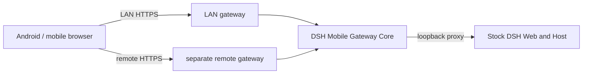

<p align="center">
  
</p>

<h1 align="center">DSH Mobile</h1>

<p align="center">Secure, live access to DeepSeek Harness from a phone.</p>

<p align="center">
  <a href="https://www.npmjs.com/package/dsh-mobile"></a>
  <a href="https://www.npmjs.com/package/dsh-mobile"></a>
  <a href="https://github.com/saya-ch/dsh-mobile/actions/workflows/ci.yml"></a>
  <a href="https://github.com/saya-ch/dsh-mobile/releases"></a>
  <a href="LICENSE"></a>
  <a href="https://github.com/awesome-dsh-plugin/awesome-dsh-plugin"></a>
</p>

<p align="center">
  <a href="#what-it-does">What it does</a> ·
  <a href="#quick-start">Quick start</a> ·
  <a href="#connection-guide">Connection guide</a> ·
  <a href="#extend-and-customize">Extend and customize</a> ·
  <a href="#device-management">Device management</a> ·
  <a href="#third-party-plugin-compatibility">Third-party plugins</a> ·
  <a href="#security">Security</a> ·
  <a href="#compatibility">Compatibility</a> ·
  <a href="#contributors">Contributors</a> ·
  <a href="CHANGELOG.md">Changelog</a> ·
  <a href="README.md">简体中文</a>
</p>

> DSH Mobile is a DeepSeek Harness community plugin; the native app supports Android only.
>
> **Current stable release: 0.6.3**. Improve plugin installation, the mobile composer and current DSH compatibility, add optional extension Workers, and strengthen connection and data reliability. [Release notes](https://github.com/saya-ch/dsh-mobile/releases/tag/v0.6.3).
>
> **Version policy**: since plugin **0.6.2**, the Android app and plugin use independent version numbers and releases. Their numbers do not need to match, and a plugin update does not imply an app update. [Compatibility notes](#compatibility).

<p align="center">
  <a href="https://github.com/saya-ch/dsh-mobile/releases/download/v0.6.1/dsh-mobile-android-v0.6.1.apk"></a><br>
  <a href="https://github.com/saya-ch/dsh-mobile/releases/download/v0.6.1/dsh-mobile-android-v0.6.1.apk"><strong>Download Android app 0.6.1</strong></a><br>
  <sub><a href="https://github.com/saya-ch/dsh-mobile/releases/tag/v0.6.1">Release notes and checksums</a></sub>
</p>

DSH Mobile is a DeepSeek Harness plugin that lets a mobile browser or the Android app connect over a protected LAN or an optional Tailscale Funnel, cpolar, cloudflared, self-hosted FRP, or own reverse-proxy remote path. Both routes reach the same sessions, Workspaces, messages, and tools. The computer manages their switches and pairing authorizations separately; the Android app lists paired computers together. The plugin does not modify DeepSeek Harness source.

Mobile access uses a dedicated HTTPS origin and device pairing. The Android app pins the private LAN CA; public remote paths use platform-trusted certificates. The self-signed FRP entry additionally requires the 0.4.6 app to pin a remote CA during pairing.

It also lets you customize the phone from a DSH conversation: `/mobile <what you want>`.

## What it does

- **Continue DSH work from a phone**: the same sessions, Workspaces, messages, and tools, in real time.
- **Customize the phone UI by talking to DSH**: request layout, interaction, or feature changes in a conversation; open pages usually refresh after the files have been changed.
- **A dedicated touch layout**: session drawer, tool details, settings, question cards, and composer reorganized for phones; the app follows the system locale (Chinese/English/Italian), plugin UI follows DSH's locale.
- **Several remote options**: Tailscale, cpolar, cloudflared quick/named tunnels, self-hosted FRP, or your own reverse proxy.
- **Pairing and multi-device**: pair once via QR code, link, or key; Wi-Fi, hotspot, or IP changes normally recover automatically; the app lists LAN and remote paired computers together, checks their reachability periodically, and lets you switch, re-pair, or delete a local record.
- **One-click diagnostics and approval**: check versions, gateway, network interface, firewall, and the remote path with a redacted report; approve blocked third-party plugin connections per exact path.
- **Task system notifications**: completion and pending-input alerts via Android system notifications, enabled from DSH General settings inside the app, with redacted lock-screen text.
- **Defense in depth**: a private CA pinned for LAN, trusted HTTPS for public remote paths, and a remote CA pinned by the 0.4.6 app for the self-signed FRP entry. Credentials are Keystore-backed, device tokens go only to their exact Origin, and third-party WebSockets are blocked by default.

A paired device can operate DSH on the computer and must be treated as fully trusted. Enable LAN access only on trusted networks, and use a reliable HTTPS channel for remote access. Revoke a lost phone from the computer immediately.

## Quick start

Install the plugin on the computer, then pair the Android app or a mobile browser. Choose the installation path for your DSH host.

### Official DSH Desktop

Install and enable `dsh-mobile` from the app's **Plugins** page, then open **Mobile Access** to configure LAN or a remote channel. The app manages its Desktop profile; the `--profile web` commands below do not apply to it.

After installing or updating, quit Desktop from the application menu and reopen it without clearing sessions or pairing data. If it still reports `dsh-mobile-question-fixes: failed to import`, check the installation log; a component-resolution failure may not be fixed by restarting alone.

### DSH Web

With an installed `dsh` command, run:

```powershell
dsh plugin --profile web add dsh-mobile@latest
dsh plugin --profile web exec dsh-mobile setup
dsh --profile web
```

<details>
<summary>DeepSeek Harness source checkout or community plugin market</summary>

From the DeepSeek Harness source directory, run:

```powershell
pnpm install
pnpm dsh plugin --profile web add dsh-mobile@latest
pnpm dsh plugin --profile web exec dsh-mobile setup
pnpm dsh --profile web
```

Or via the plugin market (optional):

```powershell
dsh plugin --profile web add dshmarket
```

Restart DSH, then search for **dsh-mobile** under **Settings → Plugin Market** and install it. On first opening Mobile access, the Local network page lists this computer's current networks; confirm one to create private certificates and LAN configuration, then restart DSH once as prompted. No terminal `setup` command is required for this path.

</details>

`setup` automatically selects and remembers the current LAN; Wi-Fi, hotspot, and IP changes normally recover without re-pairing. Use `--address 192.168.x.x` only when automatic selection fails. Settings, certificates, devices, and customization files live under `$DSH_HOME/mobile-access/`.

### Install the phone app

Download the official Android APK using the link above, or open the computer's pairing link in a mobile browser. Then choose LAN or remote access in the [connection guide](#connection-guide); the phone needs no separate tunnel client.

Registry-installed plugins check for updates when the desktop UI loads and show “Update plugin” beside the access-panel title when a newer release is available. Restart DSH after installation. The app download entry shows the latest version; local development packages are not overwritten, and Android does not check for or push app-version updates.

## Connection guide

LAN and remote access are independent connections. Prefer LAN while the phone is near the computer for the lowest latency, and enable remote access only when leaving that network. The computer manages their switches and pairing authorizations separately; the Android app shows all paired computers together in its device list.

### Local network

Use this when the phone and computer share Wi-Fi, Ethernet, or a phone hotspot. It is the default and simplest path.

<p align="center">
  
</p>

1. Connect the phone and computer to the same local network, then open **Mobile Access → Local network** in the lower-left corner of DeepSeek Harness.
2. If needed, select **Enable local access**, then select **Create and copy key**. The panel displays a pairing QR code.
3. In the Android app, open **Local network**, scan for computers, select the device, then scan the QR code or paste the pairing key.
4. Pairing creates persistent device trust. Later app launches discover and connect automatically; Wi-Fi, hotspot, and DHCP address changes normally do not require pairing again.

Port note: `dsh web --port` changes the DSH Web upstream port (3080 by default), which the plugin follows automatically. `dsh-mobile setup --port` changes the Mobile HTTPS listener (3443 by default), and the pairing QR code includes the selected port.

<details>
<summary>Headless hosts, private proxies and additional source networks</summary>

Headless Linux hosts, and browsers that open DSH Web through a LAN IP or reverse proxy, can use the same **Mobile access** control in the lower-left corner. The admin API still requires a loopback TCP peer (for example a local `socat` or reverse proxy to `127.0.0.1`) so the plugin itself is not LAN-exposed. The browser Host may be `localhost`, RFC1918, or an IPv4 link-local address; public IPs and arbitrary DNS names still return 403. The reverse proxy must be limited to trusted local or LAN callers and must not publicly forward `/api/mobile-access`. The dedicated Mobile HTTPS listener (3443 by default) remains the phone surface and does not become the desktop admin panel.

For a routed network such as WireGuard, 0.6.0 offers [additional trusted networks](docs/TRUSTED_NETWORKS.en.md). It adds explicit source CIDRs only, without creating a VPN or routes or changing Windows firewall rules.

</details>

The app is optional: select **Copy pairing link** and open it in a mobile browser. LAN uses a private certificate, which the browser may warn about on first visit; continue only after confirming that this is your DSH gateway. A public-certificate remote origin should not show a certificate warning. If it does, check the channel and certificate instead of bypassing the warning.

Browser pairing and reauthentication pages use the browser's `Accept-Language` to show Simplified Chinese, English, or Italian. Android screens follow the system language, while the DSH plugin control panel follows the language selected by DSH.

### Remote access

Use this after the phone leaves the computer's network. Remote access is disabled by default, and the phone needs no separate Tailscale, cpolar, cloudflared, or FRP app.

Remote providers may impose bandwidth and connection limits: the [cpolar Free plan](https://svip.cpolar.com/pricing) currently lists 1 Mbps, while [Tailscale Funnel](https://tailscale.com/docs/features/tailscale-funnel#requirements-and-limitations) has non-configurable bandwidth limits, and a cloudflared quick tunnel is a free Cloudflare address with randomized hostnames and rate limiting. DSH Mobile uses gzip for static assets, persistent WebSockets, and load-on-scroll history to improve loading; DSH controls the Session history window and page sizes, and the plugin cannot raise provider quotas.

If the page opens but stays on “Reconnecting,” distinguish WebSocket upgrade failures, slow synchronization, and heartbeat deadlines using the [slow-link and reconnection guide](docs/SLOW_CONNECTIONS.en.md). Version 0.5.4 also offers opt-in WebSocket compression per exact path, disabled by default; for long Sessions or metered links, follow the guide and compare actual transfer volume.

| Channel | Prerequisites | Address and limitation |
| --- | --- | --- |
| cpolar | Account and Authtoken | An option to try on mainland networks; free temporary URLs may change |
| cloudflared quick tunnel | No account or domain | Random temporary URL; no SSE, with [notification limits](docs/CLOUDFLARE_TUNNEL.en.md#quick-tunnel-feature-limits) |
| cloudflared named tunnel | Cloudflare account and domain | Fixed hostname; [setup guide](docs/CLOUDFLARE_TUNNEL.en.md) |
| Tailscale Funnel | Sign-in and Funnel authorization | May be unreliable on mainland-China networks |
| Self-hosted FRP | VPS and domain or real public IPv4 | Server maintenance required; [deploy](docs/SELF_HOSTED_FRP.en.md) or [attach to existing frps](docs/ATTACH_EXISTING_FRPS.en.md) |
| Own reverse proxy | Existing public HTTPS proxy | The plugin provides only its private authenticated backend; [guide](docs/SELF_HOSTED_ORIGIN.en.md) |

<p align="center">
  
</p>

1. Open **Mobile Access → Remote** in the lower-left corner of DeepSeek Harness, choose a channel and complete its sign-in or configuration.
2. Once ready, select **Create remote pairing QR code**. Own reverse proxy reports only **Backend listening**, so verify public HTTPS and WebSocket access as well.
3. Select **Remote access** in the Android app and scan the current QR code. A publicly trusted certificate also permits pairing from a mobile browser.
4. Later launches reconnect using the saved address and credential. If a temporary address changes, scan the current computer QR code to verify it. Do not clear app data; the stored device token never goes to a new Origin.

<details>
<summary>Installation and sign-in for each channel</summary>

After selecting the channel in the panel:
   - **Tailscale Funnel**: select **Enable remote access**, complete the one-time Tailscale sign-in on the official page, follow the panel prompt to allow Funnel, then return to DSH and wait until the connection is ready.
   - **cpolar**: select **Install official component**, sign in to the cpolar dashboard and obtain an Authtoken, paste it, then select **Save and connect**. The component is downloaded into the plugin's private directory only after confirmation; free temporary addresses may change after DSH or cpolar restarts.
   - **Self-hosted FRP (advanced)**: if you have a VPS, expand **Self-hosted connection** and enter its frps details and a public HTTPS domain or real public IPv4 address. Apply the restricted frps + Caddy template manually, or deploy with an SSH key on Ubuntu/Debian with systemd. Password login is unsupported, and the plugin does not overwrite Caddy configuration it does not manage. Verify the VPS host keys against its console before deployment or cleanup. The local `frpc` is downloaded and verified on demand; VPS cleanup is separate. Android app 0.3.3 or later is required. The [self-hosted FRP guide](docs/SELF_HOSTED_FRP.en.md) covers certificates, ports, and the complete procedure.
   - **Own reverse proxy**: open **Self-hosted connection → Own reverse proxy**, enter the public HTTPS origin (custom ports supported), private listen IPv4, separate HTTP backend port (default 3444), and allowed proxy source CIDRs, then select **Save and start backend**. This uses your existing Lucky/Nginx/Caddy without a tunnel component and requires Android app 0.4.0 or later. See the [own reverse proxy guide](docs/SELF_HOSTED_ORIGIN.en.md).
   - **cloudflared quick tunnel**: select **Install official component**. After you confirm, the plugin downloads a pinned build from the official release page into its private directory and requests a temporary public address (a quick tunnel) with **no sign-up or sign-in**. Choose this when you would rather not create an account. The quick-tunnel hostname changes on every reconnect, and Cloudflare positions quick tunnels for testing: they are rate-limited and carry no uptime guarantee, so do not rely on one for production access that must stay reachable; it suits temporary or verification use.
   - **cloudflared named tunnel**: with a Cloudflare account and domain, switch **Tunnel type** to **Named**, then supply a connector token, a public hostname and a local forward port to get an address that survives restarts. The token is stored only in the private directory and reaches cloudflared through the environment rather than the command line; see [Cloudflare named tunnel](docs/CLOUDFLARE_TUNNEL.en.md).

</details>

<details>
<summary>Remote notifications, server maintenance and security limits</summary>

> **Remote notifications**: browser `Notification` permission is granted per Origin, and a web-page system toast appears only on the device running that page. Android task reminders are a separate 0.4.0 feature: enable them under DSH **Settings → General** in the app, and keep the WebView page alive; they are not a general background push service. For reliable background delivery, use a server-side webhook or bot channel you have configured.

Tailscale Funnel has broad reach but may be unreliable from mainland China. Its runtime ties the public listener to the parent process and a bounded control channel; parent exit, channel closure, or an explicit stop ends the current generation and cleans up its resources. cpolar is better suited to mainland networks, while self-hosted FRP fits users who already have a VPS and want to avoid public-provider bandwidth quotas. cloudflared runs in two modes: a quick tunnel needs no account or sign-in, but its hostname is random, changes on every reconnect, and is [intended by Cloudflare for testing](https://developers.cloudflare.com/cloudflare-one/networks/connectors/cloudflare-tunnel/do-more-with-tunnels/trycloudflare/) without an uptime guarantee, so it suits temporary or verification use rather than a permanent channel; a named tunnel uses a Cloudflare account token and keeps one fixed public hostname across restarts. An unregistered domain on a mainland-China VPS may be intercepted by the cloud provider; public IPv4 mode avoids that dependency. The plugin validates pinned on-demand components; locally managed configuration and binaries live under `$DSH_HOME/mobile-access/` and can be cleaned up from the panel. VPS files require separate cleanup through the self-hosted connection guide.

Managed self-hosted FRP uses an HTTP vhost to the DSH loopback gateway. Its plaintext VPS listener must be loopback-only, with Caddy providing public HTTPS. Version 0.4.6 adds existing-frps attachment without installing or changing the server: its public-CA mode still needs a restricted HTTP vhost and Caddy, while its self-signed mode forwards raw TCP to a computer-side HTTPS gateway whose CA the 0.4.6 Android app pins during pairing. The self-signed mode currently uses public IPv4 and is unavailable to older apps. Neither mode exposes arbitrary FRP configuration. Because frps `proxyBindAddr` governs proxy listeners globally, do not change it for the new TCP entry without checking existing plaintext vhosts. See the [attachment guide](docs/ATTACH_EXISTING_FRPS.en.md).

The own-proxy HTTP backend must remain on a trusted private network: **never port-forward it publicly or bypass it by proxying to DSH or the existing LAN 3443 gateway**. CIDRs match the proxy's direct TCP peer, not forwarded headers. Preserve the external Host (including port), Origin, cookies and WebSocket. Clearing proxy settings keeps paired remote devices.

See [Compatibility](#compatibility) for the supported components and platforms. Locally managed programs, credentials and settings can be removed from the panel; VPS files require separate cleanup through the corresponding guide.

</details>

## Extend and customize

Type `/mobile <what you want>` in a DSH conversation to hand the request to the current agent. Once the files have been changed, the phone page usually refreshes within a few seconds. For example:

```text
/mobile turn the phone UI into an old CRT terminal, with messages scrolling like terminal output
```

It can also drive computer capabilities the phone can use, like reading the machine's live state:

```text
/mobile give the phone a cyberpunk-style computer monitor panel that shows live CPU, memory, and disk usage
```

Two kinds of changes are supported: the phone UI itself (theme, layout, buttons), and computer capabilities the phone can use (browsing computer files, running programs on the computer). `/mobile` hands the request to the DSH agent, which edits files under the local DSH configuration directory (`$DSH_HOME/mobile-access/`); the phone client applies them automatically. UI changes live in `mobile.css`/`mobile.js`. Computer capabilities come from extensions under `extensions/`, whose `host.mjs` runs with the local user's privileges on the computer. DeepSeek Harness source is not modified.

Extension manifests, scripts, styles, and assets are revisioned. When the plugin observes a `/mobile` or extension-file change, it notifies authenticated phones to refresh immediately; 45-second visible and 5-minute hidden checks remain only as recovery fallbacks. A failed Host staging pass keeps the current version; if the Host has changed but the new phone UI cannot activate, that extension closes and retries instead of mixing generations.

An extension action's `input` may use a callable Schemastery schema such as `api.schema.object(...)` or an adapter with `parse(value)`; mobile `api.host.invoke()` sends JSON explicitly, and the input is validated and normalized before the computer-side action runs.

The 0.6.3 release adds optional [Worker execution](docs/EXTENSION_WORKERS.en.md) for trusted local JavaScript hosts. It is disabled by default, selectable by extension, and recovers explicitly without replaying interrupted actions. It is not a permission sandbox and does not require a matching App version.

<sub>You can even use an extension to connect to SillyTavern running on the same computer, give it a lightweight mobile frontend, and open it from the same app.</sub>

> `host.mjs` has the same privileges as a local program. Create and run only computer-side extensions that you understand and trust.

The examples above, applied:

<p align="center">
  
  
  
  
</p>

## Device management

The Android app lists computers and their LAN/remote records under **Paired computers**. The two authorization types remain separate, so one computer can have two rows. Upgrades migrate old credentials without re-pairing; after a changed address is verified, matching identities merge and keep their names. Self-signed FRP uses a separate CA fingerprint and may create another row. Android Keystore encrypts tokens and pinned CAs. A pairing QR code contains temporary pairing information, never a long-lived device token or CA private key.

Each row shows its custom name, transport, Origin, periodically refreshed reachability, and last connection time. A green dot means **Reachable**; a gray dot means **Checking**, **Temporarily unreachable**, **Pairing expired**, or **Removed on computer**. The check validates the DSH Gateway over HTTPS instead of using ICMP, so a temporary network outage is not mistaken for computer-side revocation.

- **Startup behavior → Open DSH directly** (default): one device connects directly; with multiple devices, the app tries the last-used device first, then the still-valid device with the most recent connection. A bounded connection budget returns to the list instead of spinning forever.
- **Startup behavior → Show device list**: choose a computer on every launch, which is useful when switching between several machines. Open the list's top-right **Settings → Startup behavior**; changes are saved immediately.
- Tap a row to connect. The overflow button and long press open the same action sheet for rename, check now, pair again, or delete the local record. Deletion has a second confirmation and a short undo window; undo restores only the local row and never restores a computer-side revocation.
- Open DSH **Settings → General → Switch computer** in the WebView to return to the list. An online computer-side revocation keeps the row as **Removed on computer**, stops reconnection and offers re-pairing or local deletion.
- **Added in 0.6.0**: fixed order, new computers appended, and migration of the previously visible order. **Move up / Move to top** save the arrangement independently from startup selection. Inside the app, hold the top-left drawer toggle to return to the list; a normal tap still toggles the drawer. Browsers have no such native action.

Revoking a device permanently deletes its durable record and token digest instead of retaining a `revokedAt` tombstone. Startup also removes legacy revoked rows. A deleted token receives `401 authentication_failed`, just like an unknown token. Existing apps checking a device that was revoked while offline may therefore show **Pairing expired** and require pairing again; online Sessions still receive the revocation notification and disconnect immediately.

<table>
  <tr>
    <td align="center" valign="top" width="50%">
      <br>
      <sub>Device management: paired computers, transport, and reachability</sub>
    </td>
    <td align="center" valign="top" width="50%">
      <br>
      <sub>Startup behavior: open DSH directly or show the device list</sub>
    </td>
  </tr>
</table>

## Third-party plugin compatibility

Version 0.5.3 includes the independently switchable `dsh-mobile-question-fixes` component, enabled by default. Disable it in DSH's plugin component list to restore the stock card immediately. Long questions, options, and footer actions share one bounded scroll area, and collapsed titles show up to two lines. Touch Enter retains its newline in phone browsers; the Android app applies this behavior only when its software keyboard is open and no hardware keyboard is connected. DSH continues to own answer drafts, with no additional copy in browser localStorage.

DSH Mobile keeps the Workspace, task-management, terminal and file-panel entry points; DSH still loads third-party plugins. The mobile layer adapts layout and access without changing DSH source. A particular plugin's usability on a small screen still depends on its own layout and interactions.

A third-party plugin must work in DSH Web and use reachable HTTP/WebSocket interfaces. The mobile layer cannot guarantee a phone layout for every plugin or replace a desktop-native window required by that plugin.

### WebSocket approval

- The gateway allows first-party DSH WebSocket paths by default, including `/sidebar/ws/terminal`. Other paths used by community sidebar plugins are blocked by default and appear in Diagnostics; the `/sidebar/ws/agent-opens` and `/sidebar/ws/agent-terminals` paths in the image are examples that must be reviewed for the actual plugin.
- In **Connection diagnostics → Third-party WebSocket paths**, select **Allow** only for an exact path you have verified. Query strings and fuzzy prefixes are rejected; **Allow all** is not recommended. Approved paths can be removed at any time, and the same policy applies to LAN and remote connections.
- Approval only lets that path pass through the authenticated, same-origin DSH Mobile gateway. It does not open arbitrary TCP/UDP ports or bypass device pairing. If a community plugin still fails, check the path recorded by Diagnostics and approve one path at a time.

If another remote-access plugin shows its own “not paired” page inside DSH Mobile, the two authorization systems are separate. Temporarily turn off the other plugin's remote access on the computer to check whether the Mobile path recovers; do not enter a DSH Mobile pairing key on that page. Excluding its client module below does not necessarily remove a request-rewriting script injected before client boot. See [#111](https://github.com/saya-ch/dsh-mobile/issues/111).

Allowing HTTP frames in the gateway does not make every client load them: the content is unencrypted, Android still blocks HTTP mixed content inside HTTPS pages, and browsers may block it too. Prefer HTTPS. The remote panel shows this risk when opened through an HTTPS administration entry.

### Optional modules and advanced configuration

Version 0.6.0 adds [mobile page module settings](docs/CLIENT_MODULES.en.md) for computer defaults and device choices without uninstalling plugins. Changes apply on the next manual open, not an automatic conversation reload; an outdated saved selection offers an explicit recovery action.

<details>
<summary>Configure excludedClientModules in the profile</summary>

Advanced users can reduce mobile startup traffic by adding exact package ids to `excludedClientModules` in the current profile's `mobile-access` plugin configuration, then restarting DSH. This changes only the dedicated mobile page served through the gateway; desktop and `?frontend=stock` pages are unaffected. If both packages are present in the current boot graph, this example removes document preview and its dependent “Open In…” feature:

```yaml
excludedClientModules:
  - '@deepseek-ai/dsh-client-ui-sidebar-documentpreview'
  - '@deepseek-ai/dsh-client-ui-open-in-app'
```

There is no default exclusion list. The plugin rejects unknown or boot-critical modules and modules still referenced through `inject` or `external` by retained entries. If a DSH or community-plugin update invalidates the selection, the mobile page returns `409 excluded_client_modules_invalid` with the conflicting module; the computer also warns so you can adjust or remove the option. Bundle sizes and dependencies change between DSH installations and versions; another user's savings are not a prediction for yours.

Selection priority is device choice → computer defaults → plugin configuration. See the [module guide](docs/CLIENT_MODULES.en.md) for application and recovery rules.

</details>

<table>
  <tr>
    <td align="center" valign="top" width="50%">
      <br>
      <sub>Community sidebar plugin compatibility in the Android app</sub>
    </td>
    <td align="center" valign="top" width="50%">
      <br>
      <sub>Connection diagnostics: review and allow third-party WebSocket paths</sub>
    </td>
  </tr>
</table>

## App or mobile browser

| Client | Best for | Notes |
| --- | --- | --- |
| Android app | Everyday use | Separate Local and Remote entries at first pairing; LAN discovery, system trust for public remote certificates, and app-pinned CA for the self-signed FRP entry |
| Mobile browser | Temporary or cross-platform | Open the HTTPS origin shown by Mobile Access; a private LAN certificate may need confirmation, while a public remote certificate should not warn |

The Android app is a thin Kotlin WebView shell and contains no frontend copy; mobile browsers load the same page. For compatibility diagnosis, append `?frontend=stock` to the browser URL to temporarily use the previous desktop-page adaptation.

In 0.5.5, the dedicated mobile page synchronously loads the authenticated, same-origin `/mobile-access/compat.js` before the first DSH boot script. This bundled core-js compatibility layer supplies `Iterator` / Iterator helpers to WebViews that lack them, preventing the startup error `Iterator is not defined`. It uses feature detection to preserve or repair native helpers, needs no CDN, and does not weaken CSP. The desktop and `?frontend=stock` pages do not load this gateway script.

Version 0.6.0 adds feature-detected `Promise.withResolvers` and `AbortSignal.any` implementations to the same pre-boot script. On WebViews that support document-start injection, the Android app also supplies `Promise.withResolvers` early for the paired exact Origin. This covers identified missing APIs, not every old engine; the frontend still targets ES2022, and this version has not been verified on the reported physical Huawei WebView 114 device. If other compatibility errors remain and the device allows updates, update Android System WebView / Chrome first. If the system component cannot be updated, retain the full error, engine version, and entry mode for diagnosis.

> **Community client (unofficial)**: [WeChat Mini-Program client](https://github.com/StrawberryAO/dsh-mobile-minapp)
> A native WeChat Mini-Program that reuses the Mobile Access pairing and Remote stream protocol (requires dsh-mobile ≥ 0.3.8).
> Because WeChat release builds enforce a domain allow-list (ICP-registered HTTPS origins only), it currently works via WeChat DevTools / real-device debugging; see its README.

## How it works


```mermaid
flowchart LR
  Phone["Android / mobile browser"] -->|"LAN HTTPS"| Lan["LAN gateway"]
  Phone -->|"remote HTTPS"| Remote["separate remote gateway"]
  Lan --> Gateway["DSH Mobile Gateway Core"]
  Remote --> Gateway
  Gateway -->|"loopback proxy"| DSH["Stock DSH Web and Host"]
```

Three layers: the Host face for discovery, pairing, HTTPS, loopback proxying, and extension registration; the Client face for the dedicated mobile layout and extension SDK; and the Android app for a narrow native bridge. The bridge uses `androidx.webkit` WebMessage, verifies the exact top-level origin and main frame on every bounded message, and never uses `addJavascriptInterface`. Neither the DeepSeek Harness source nor its active Web page (port 3080 by default, configurable through `dsh web --port`) is modified.

## Security

- Use the LAN listener only on a trusted home, office, or hotspot network; do not add your own port forwarding.
- A remote origin is publicly reachable, but unpaired requests cannot enter DSH; turn the remote switch off when it is not needed.
- cpolar downloads a pinned official build only after confirmation and verifies its size and SHA-256. It installs no system service, PATH entry, or startup task, and plugin cleanup removes its managed files.
- cloudflared likewise downloads a pinned build from the official GitHub Release only after confirmation and verifies the exact size and SHA-256, and it launches the client with automatic updates disabled so the running binary is always the verified one. A quick tunnel needs no account, token, or DNS record; a named tunnel token is stored only in the plugin private directory and reaches cloudflared through the environment, and cleanup deletes every file it manages.
- Self-hosted FRP downloads pinned official `frpc` only after confirmation and verifies the origin, exact size, SHA-256, archive paths, and executable version. The shared token never appears in status, diagnostics, or attachment-plan responses. Copying a server template, or explicitly copying a token-bearing attach config after re-entering its token, places it on the system clipboard; clear it after use. Local cleanup removes only plugin-managed files. Managed VPS deployments require separate uninstall-script or one-click cleanup; attaching to an existing frps neither changes nor cleans up that VPS. Automatic deployment and server cleanup require SSH host-key verification against the VPS console.
- A paired device is a fully trusted DeepSeek Harness operator and can run tools on the computer; revoke lost devices from the computer.
- The mobile gateway proxies requests as a local DSH operator and supports `GET`, `HEAD`, `POST`, `PUT`, `PATCH`, and `DELETE` on ordinary plugin routes; writes still require a paired Session, exact Origin, and CSRF validation. Third-party plugins must not treat the upstream loopback Host as proof that the client is physically local to the computer.
- The LAN gateway listens only while Mobile Access is enabled; with it off, DSH keeps running normally on the computer.

See [SECURITY.md](SECURITY.md).

## Troubleshooting

- **Pairing succeeds but renewal returns `401` or repeatedly asks to pair again**: other services on the same hostname or stale Cookies may interfere with authentication. Update to the latest plugin and app, then retry through the current Mobile Access entry. In a browser, scanning the current QR code again refreshes this plugin's authentication Cookies without clearing all website data. If it still fails, inspect the failed request and sanitized logs; other authentication or proxy errors can also return `401`.
- **The testing notice cannot be confirmed or settings cannot be saved**: open DSH directly at its local address on the computer, then inspect the terminal log or the failed settings request in the browser's Network panel. Connection diagnostics do not test settings writes. Keep the existing configuration and `settings.yaml.imported`, and investigate the specific error; the same UI message can have different causes. See [DSH #860](https://github.com/deepseek-ai/deepseek-harness/discussions/860).
- **A settings request returns HTTP `403`**: first inspect DSH's Host/Origin trust checks and any proxy response. Check whether an iframe, proxy, or browser extension changes the request's origin, and verify direct local access. Keep the trust checks enabled.
- **The error contains `profile reload requires the root Include entry`**: this error occurs while DSH reloads the profile. [Issue #132](https://github.com/saya-ch/dsh-mobile/issues/132) reports it after two copies of `dsh-app-boot` were loaded, but the message alone does not establish that cause. Compare the versions and installation paths used by the running DSH command and the active profile; keep the configuration and follow the [official DSH documentation](https://deepseek-harness.github.io/deepseek-harness/) to repair the dependencies. If it still fails, report the versions, module paths, and full sanitized error upstream.
- **The settings error contains `EACCES`, `EPERM`, or a lock-file failure**: inspect the reported file's permissions and any file-operation tools injected into the launch environment. Lock cleanup can fail after a write, so check what was actually saved.
- **The phone shows another plugin’s pairing-code page**: `dsh-remote-web-ui` and DSH Mobile have separate remote channels and pairing codes; they cannot be mixed. If DSH Mobile diagnostics warn about a competing remote plugin, turn off that plugin’s remote access on the computer, refresh, and scan the current DSH Mobile QR code. Merely installing the other plugin without enabling its remote channel does not trigger this warning.
- **Remote diagnostics say “reachable through the computer's proxy”**: the check tries a direct request first, then an HTTP proxy from the DSH process environment only if direct access fails; `NO_PROXY` may exclude the target. This proves only that the computer completed an HTTPS probe through the proxy, not that the phone or actual tunnel can connect. Test from the phone's mobile network. If both paths fail, diagnostics continue to report the endpoint unreachable instead of treating an offline route as ready.
- **LAN access stops after switching networks**: if the log reports `saved LAN interface "XXX" is not connected`, the saved adapter is unavailable. DSH keeps running while Mobile Access stays dormant and retries when the adapter returns. If you have moved to a different adapter, configure LAN again or re-run `setup`. If mobile access is not needed, disable `mobile-access` in `cordis.patch.yml`.

## Compatibility

The table records tested DSH and plugin version combinations; it does not imply automatic compatibility with other versions. Since 0.3.6 the plugin has not rejected DSH solely by version number. If mobile access breaks after upgrading DSH, check this table and update the plugin first. History lives in [CHANGELOG.md](CHANGELOG.md).

Version 0.5.2 keeps the DSH host peer names but does not block installation by DSH version. New releases still need the source-contract and paired-browser checks below; an unlisted version is not automatically verified.

### OS support matrix

| Channel | Windows x64 | Linux x64 | Linux arm64 | macOS |
| --- | --- | --- | --- | --- |
| Local network | Yes (firewall automated) | Yes (open the firewall yourself) | Yes | Yes |
| Tailscale Funnel | Yes (bundled) | Yes (bundled) | Yes (bundled) | No |
| cpolar | Yes (on-demand) | Yes (on-demand) | Yes (on-demand) | No |
| cloudflared quick/named tunnel | Yes (on-demand) | Yes (on-demand) | Yes (on-demand) | Yes, x64/arm64 (on-demand) |
| Self-hosted FRP | Yes (on-demand) | Yes (on-demand) | Yes (on-demand) | Yes (on-demand) |
| Own reverse proxy | Yes (config only) | Yes (config only) | Yes (config only) | Yes (config only) |

On macOS, local network, cloudflared, self-hosted FRP and the own reverse proxy work; Funnel and cpolar have no managed macOS component yet. The diagnostics firewall check currently covers Windows only and reports “not applicable” elsewhere.

| DSH Mobile plugin | Verified DeepSeek Harness version |
| --- | --- |
| `0.5.5` | `0.1.7-alpha.2`, `0.1.7-rc.1`, `0.1.7-rc.2`, `0.2.0-rc.1`, and `0.2.0-rc.2` (npm installation, isolated pairing, mobile-page boot, and WebSocket Workspace baseline) |
| `0.6.0` | `0.1.7-alpha.2`, `0.1.7-rc.1`, `0.1.7-rc.2`, `0.2.0-rc.1` and `0.2.0-rc.2` (packed installation, pairing, mobile-page boot and WebSocket Workspace reads); additional checks cover the mobile composer, module settings and component loading after a normal official Desktop restart |
| `0.6.2` | Packed legacy-WebView boot, touch scrolling and missing-API/viewport negative controls passed on `0.2.0-rc.2`, with release CI passing. The reporter's physical old devices in #187 were not claimed as accepted |
| `0.6.3` | `0.2.0-rc.2` and `0.2.1-alpha.2` (packed installation, isolated pairing, mobile boot and WebSocket Workspace reads); additional checks cover the composer, settings and extension Worker timeout, streaming and explicit recovery |

<details>
<summary>Historical version checks</summary>

| DSH Mobile plugin | Verified DeepSeek Harness version |
| --- | --- |
| `0.5.4` | `0.1.7-alpha.2`, `0.1.7-rc.1`, `0.1.7-rc.2`, `0.2.0-rc.1`, and `0.2.0-rc.2` (npm installation, isolated pairing, mobile-page boot, and WebSocket Workspace baseline) |
| `0.5.3` | `0.1.7-alpha.2`, `0.1.7-rc.1`, `0.1.7-rc.2`, `0.2.0-rc.1`, and `0.2.0-rc.2` (source contract, npm installation, isolated pairing, mobile-page boot, and WebSocket Workspace baseline) |
| `0.5.2` | `0.1.7-alpha.2`, `0.1.7-rc.1`, `0.1.7-rc.2`, and `0.2.0-rc.1` (carried forward from earlier verification); `0.2.0-rc.2` (source contract, isolated pairing, mobile-page boot, and WebSocket Workspace baseline) |
| `0.5.1` | `0.1.7-alpha.2`, `0.1.7-rc.1`, `0.1.7-rc.2`, and `0.2.0-rc.1`; official Desktop `0.1.7-rc.2` (administration surface) |
| `0.5.0` | `0.1.7-alpha.2`, `0.1.7-rc.1`, and `0.1.7-rc.2`; official Desktop `0.1.7-rc.2` (administration surface) |
| `0.4.7` | `0.1.7-alpha.2`, `0.1.7-rc.1`, and `0.1.7-rc.2` (source contract, isolated pairing, and workspace baseline over WebSocket) |
| `0.4.6` | `0.1.7-alpha.2` and `0.1.7-rc.1` (source contract, isolated pairing, and workspace baseline over WebSocket) |
| `0.4.5` | `0.1.7-alpha.2` (source contract check, local and remote gateway integration) |
| `0.4.4` | `0.1.6-alpha.2` (local source and renderer-v2 contract check) |
| `0.4.3` | `0.1.6-alpha.2` (local source and renderer-v2 contract check) |
| `0.4.2` | `0.1.6-alpha.1` (local source and renderer-v2 contract check) |
| `0.4.1` | `0.1.6-alpha.1` (local source and renderer-v2 contract check) |
| `0.3.15`, `0.3.16`, `0.4.0` | `0.1.5-rc.2` (contract check); `0.1.5-rc.1` (@idoall LAN verification) |
| `0.3.14` | `0.1.3-alpha.2` |
| `0.3.9`-`0.3.12` | `0.1.3-alpha.1` |
| `0.3.6`-`0.3.8` | `0.1.2-rc.1` |
| `0.3.4`, `0.3.5` | `0.1.2-alpha.2` |
| `0.3.0`-`0.3.3` | `0.1.2-alpha.1` |
| `0.1.4`, `0.2.x` | `0.1.1-rc.2` |

</details>

Existing apps (0.3.3 and later) do not need re-pairing. cpolar users should use app 0.3.15 or later because earlier apps may time out before a slow first load over the free route finishes; earlier apps also use a different status-bar strategy. The 0.4.0 app adds the multi-device list, startup behavior, and computer-side revocation status; older apps continue to connect to their saved single device. App 0.1.3 or earlier requires reinstalling and pairing again.

The current stable Android app is 0.6.1 (build 77), retaining 0.6.0's native features and pairing/renewal protocol without requiring re-pairing. Plugin and app version numbers do not need to match; connections check protocol and minimum-version requirements. Features with additional native requirements state the app version they need.

GitHub Release APKs use a stable signing certificate, so an older official APK with the same signer can be upgraded in place while retaining pairings. A locally built Debug APK with a different signer cannot be overwritten by the official APK; plan to pair again when switching between them.

## Uninstall

Choose one of the two Web-profile paths below. In official DSH Desktop, uninstall the plugin from the app's **Plugins** page. Uninstalling the package alone leaves certificates, pairing records, and custom files under `$DSH_HOME/mobile-access/` intact.

Remove only the plugin and keep local data:

```powershell
dsh plugin --profile web remove dsh-mobile
```

To remove local plugin data as well, first back up extensions and custom files you want to keep. **Run `purge --yes` before removing the plugin**; do not run the preceding remove-only command first. `purge` deletes the entire `$DSH_HOME/mobile-access/` directory and the plugin's Windows firewall rules, but it does not remove VPS files.

```powershell
dsh plugin --profile web exec dsh-mobile purge --yes
dsh plugin --profile web remove dsh-mobile
```

Source users replace `dsh` with `pnpm dsh`.

## Contributors

Thanks to everyone who submitted PRs, reproduced issues, or proposed improvements. [The contributors list](CONTRIBUTORS.md) credits merged PRs, PR work later incorporated without a direct merge, and issue reports separately. GitHub's sidebar Contributors panel is generated from commits on the default branch and cannot be manually extended with issue-only contributors.

## Development

```powershell
npm ci
npm run verify
```

Use `npm run check:docs` for quick documentation checks. [CONTRIBUTING.md](CONTRIBUTING.md) covers behavior-specific browser tests, isolated packed DSH acceptance, captures and release steps; the [Android manual](apps/mobile/README.md#build) covers app builds. Do not substitute real user profiles or official app data for test fixtures.

Licensed under [Apache-2.0](LICENSE).
