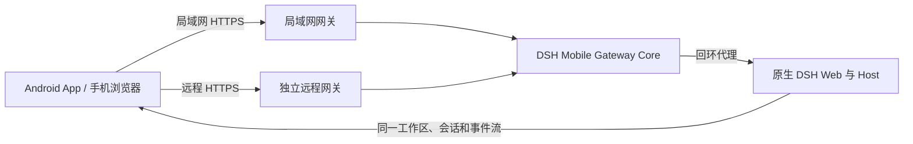

<p align="center">
  
</p>

<h1 align="center">DSH Mobile</h1>

<p align="center">在手机上安全、实时地使用电脑中的 DeepSeek Harness。</p>

<p align="center">
  <a href="https://www.npmjs.com/package/dsh-mobile"></a>
  <a href="https://www.npmjs.com/package/dsh-mobile"></a>
  <a href="https://github.com/saya-ch/dsh-mobile/actions/workflows/ci.yml"></a>
  <a href="https://github.com/saya-ch/dsh-mobile/releases"></a>
  <a href="LICENSE"></a>
  <a href="https://github.com/awesome-dsh-plugin/awesome-dsh-plugin"></a>
</p>

<p align="center">
  <a href="#能做什么">能做什么</a> ·
  <a href="#快速开始">快速开始</a> ·
  <a href="#连接教程">连接教程</a> ·
  <a href="#扩展与自定义">扩展与自定义</a> ·
  <a href="#设备管理">设备管理</a> ·
  <a href="#第三方插件适配">第三方插件适配</a> ·
  <a href="#安全">安全</a> ·
  <a href="#兼容性">兼容性</a> ·
  <a href="#贡献者">贡献者</a> ·
  <a href="CHANGELOG.md">更新记录</a> ·
  <a href="README.en.md">English</a>
</p>

> DSH Mobile 是 DeepSeek Harness 社区插件，原生 App 仅支持 Android。
>
> **当前版本：0.5.0**。适配 DSH 官方桌面端，支持移动端文件上传与语音输入权限，并优化窄屏操作和远程故障提示。[更新记录](CHANGELOG.md#050---2026-09-26)。
>
> **升级提醒**：建议插件与 Android App 同步更新至 0.5.0，已有配对会保留。App 的麦克风权限适配需要 0.5.0；旧版 App 的既有连接方式不受影响。[兼容说明](#兼容性)。

<p align="center">
  <a href="https://github.com/saya-ch/dsh-mobile/releases/download/v0.5.0/dsh-mobile-android-v0.5.0.apk"></a><br>
  <a href="https://github.com/saya-ch/dsh-mobile/releases/download/v0.5.0/dsh-mobile-android-v0.5.0.apk"><strong>下载 Android App 0.5.0</strong></a><br>
  <sub><a href="https://github.com/saya-ch/dsh-mobile/releases/tag/v0.5.0">版本说明与校验文件</a></sub>
</p>

DSH Mobile 是一个 DeepSeek Harness 插件，让手机浏览器或 Android App 通过局域网，或可选的 Tailscale Funnel、cpolar、cloudflared、自建 FRP 或自有反向代理远程通道连接电脑，继续使用同一份会话、工作区、消息和工具。电脑端分别启停局域网与远程访问、分别管理配对授权；Android App 统一显示已配对电脑。插件不修改 DeepSeek Harness 源码。

移动访问使用独立 HTTPS 与设备配对；Android App 固定局域网私有 CA，公开远程通道使用系统信任的证书；自签 FRP 入口还需由 0.4.6 App 在配对时固定远程 CA。

它还能在 DSH 对话里用 `/mobile <需求>` 定制手机端。

## 能做什么

- **在手机上继续电脑端的工作**：同一份会话、工作区、消息和工具，实时同步。
- **用对话定制手机端**：直接在 DSH 对话里改手机页面的布局、交互和功能，几秒内刷新。
- **专属触屏布局**：会话抽屉、工具详情、设置、提问卡片和输入栏都按手机重新组织；App 跟随系统语言（简/英/意），插件界面跟随 DSH 语言。
- **多种远程通道**：Tailscale、cpolar、cloudflared 快速/命名隧道、自建 FRP、自有反向代理，按网络任选。
- **配对与多设备**：扫码、链接或密钥配对一次；切换 Wi-Fi、热点或 IP 后通常自动恢复；App 在一个列表中显示局域网和远程配对的电脑，定期检测可达状态，并支持切换、重新配对或删除本地记录。
- **一键诊断与放行**：检查版本、网关、网卡、防火墙和远程通道，生成脱敏报告；被拦截的第三方插件连接按确切路径一键放行。
- **任务系统通知**：任务完成与待输入以 Android 系统通知提醒，可在 App 内的 DSH“通用设置”中开启，锁屏文本脱敏。
- **纵深安全**：局域网固定私有 CA，公开远程入口使用受信任 HTTPS；自签 FRP 入口由 0.4.6 App 固定远程 CA。凭据存 Keystore，设备令牌只发往精确 Origin，第三方 WS 默认拦截。

配对设备可以操作电脑上的 DSH，应视为完全受信任的设备。局域网只在可信网络开启；远程访问应使用可靠的 HTTPS 通道。手机丢失时，请立即从电脑端撤销设备。

## 快速开始

已经安装 `dsh` 命令：

```powershell
dsh plugin --profile web add dsh-mobile@latest
dsh plugin --profile web exec dsh-mobile setup
dsh --profile web
```

直接使用 DeepSeek Harness 源码：

```powershell
corepack enable; pnpm install
pnpm dsh plugin --profile web add dsh-mobile@latest
pnpm dsh plugin --profile web exec dsh-mobile setup
pnpm dsh --profile web
```

使用官方 DSH Desktop：在应用的 **插件** 页面安装并启用 `dsh-mobile`，再打开 **移动访问** 完成局域网配置或选择远程通道。Desktop 的 profile 由应用管理，不适用上面的 `--profile web` 命令。

也可以通过插件市场安装（可选）：

```powershell
dsh plugin --profile web add dshmarket
```

重启 DSH 后，在 **设置 → 插件市场** 里搜索 dsh-mobile 并安装。首次打开“移动访问”时，局域网页会列出电脑当前网络；确认网卡后由插件生成私有证书并配置局域网，按提示重启一次 DSH 即可使用，无需再打开终端运行 `setup`。

`setup` 会自动选择并记住当前局域网，切换 Wi-Fi、热点或 IP 后通常自动恢复；仅在自动选择失败时使用 `--address 192.168.x.x`。设置、证书、设备和自定义文件保存在 `$DSH_HOME/mobile-access/`。

安装并启动 DSH 后，按照下一节选择局域网或远程连接。

通过 npm 安装的插件会在桌面界面加载时检查新版本，有更新时在访问面板标题右侧显示“更新插件”，安装后需重启 DSH。App 下载入口展示最新版本；本地开发包不会被自动覆盖，Android App 不会主动检查或推送版本更新。

## 连接教程

局域网和远程访问是两套相互独立的连接：在电脑附近优先使用局域网，延迟最低；离开当前网络时再启用远程访问。电脑端分别管理开关与配对授权；Android App 将所有已配对电脑集中显示在设备列表中。

### 局域网访问

适合同一 Wi-Fi、以太网或手机热点，是默认且最简单的连接方式。

<p align="center">
  
</p>

1. 让手机和电脑连接同一个局域网，在 DeepSeek Harness 左下角打开 **移动访问 → 局域网**。
2. 如果尚未开启，点击 **开启局域网访问**；随后点击 **生成并复制密钥**，面板会显示配对二维码。
3. 在 Android App 中进入 **局域网访问**，扫描发现电脑并点击设备，再扫描二维码或粘贴配对密钥。
4. 配对完成后会建立持久设备信任。以后打开 App 会自动发现并连接，切换 Wi-Fi、热点或 DHCP 地址通常不需要重新配对。

端口说明：`dsh web --port` 修改 DSH Web 上游端口（默认 3080），插件会自动跟随；`dsh-mobile setup --port` 修改 Mobile HTTPS 监听端口（默认 3443），配对二维码会包含实际端口。

无图形界面的 Linux 主机，或通过局域网 IP / 反向代理打开 DSH Web 时，左下角 **移动访问** 管理口同样可用。管理 API 仍要求 TCP 对端是本机回环（例如本机 `socat` / 反向代理连到 `127.0.0.1`），不会把插件自己暴露到公网；浏览器 Host 可以是 `localhost`、RFC1918 或 IPv4 链路本地地址，公网 IP 和任意域名仍会返回 403。反向代理必须只对可信的本机或内网请求开放，不能把 `/api/mobile-access` 管理路径公开转发到互联网。手机走的独立 HTTPS 入口（默认 3443）仍是移动端界面，不会变成桌面管理口。

不安装 App 也可以访问：点击 **复制配对链接**，在手机浏览器中打开。局域网使用私有证书，浏览器首次访问可能提示不受信任；只在确认这是自己的 DSH 网关后按浏览器指引继续。公开证书的远程入口不应出现证书警告，若出现请检查通道和证书，不要直接忽略。

手机浏览器中的配对和重新连接页面会按浏览器的 `Accept-Language` 显示简体中文、英文或意大利文；Android App 则跟随系统语言。DSH 内的插件控制面板继续跟随 DSH 当前语言。

### 远程访问

适合手机离开电脑所在网络后使用。远程访问默认关闭，手机不需要另外安装 Tailscale、cpolar、cloudflared 或 FRP。

远程服务可能受带宽和连接限额影响：[cpolar 免费方案](https://svip.cpolar.com/pricing) 当前为 1 Mbps，[Tailscale Funnel](https://tailscale.com/docs/features/tailscale-funnel#requirements-and-limitations) 也存在不可配置的带宽限制，cloudflared 的 quick tunnel 由 Cloudflare 免费提供、地址随机且有限流。DSH Mobile 通过 10 条分页、顶部按需加载、gzip 和 WebSocket 长连接减少流量与等待，但无法突破服务商限额。

<p align="center">
  
</p>

1. 在 DeepSeek Harness 左下角打开 **移动访问 → 远程**，选择一种连接方式：
   - **Tailscale Funnel**：点击 **启用远程访问**，在打开的官方页面完成一次 Tailscale 登录；按面板提示继续允许 Funnel，然后返回 DSH 等待连接就绪。
   - **cpolar**：点击 **安装官方组件**，登录 cpolar 控制台取得 Authtoken，粘贴后点击 **保存并连接**。组件只会在确认后下载到插件私有目录；免费临时地址可能在 DSH 或 cpolar 重启后变化。
   - **自建 FRP（高级）**：已有 VPS 时，展开 **自建连接**，填写 frps 信息和公开 HTTPS 域名或真实公网 IPv4。可以复制受限的 frps + Caddy 模板手动部署，也可以在 Ubuntu/Debian + systemd 上用 SSH 密钥一键部署；不支持密码登录，也不会覆盖非 DSH Mobile 管理的 Caddy 配置。部署或清理前须到 VPS 控制台核对主机指纹。本机 `frpc` 按需下载校验，VPS 需单独清理。需要 Android App 0.3.3 或更新版本；证书、端口和操作步骤见 [自建 FRP 使用指南](docs/SELF_HOSTED_FRP.md)。
   - **自有反向代理**：展开 **自建连接 → 自有反向代理**，填写公网 HTTPS 地址（支持自定义端口）、私有监听 IPv4、独立 HTTP 后端端口（默认 3444）和代理来源 CIDR，再点击 **保存并启动后端**。适合已有 Lucky/Nginx/Caddy 的用户，无需隧道组件；需要 Android App 0.4.0 或更高版本。详见 [自有反向代理指南](docs/SELF_HOSTED_ORIGIN.md)。
   - **cloudflared 快速隧道**：点击 **安装官方组件**，插件在确认后从官方发布页下载固定版本到插件私有目录，随后自动申请一个临时公网地址（quick tunnel），**无需注册或登录**。适合不想注册账号的用户；quick tunnel 地址每次重连都会变化，官方定位为测试用途、有限流且无可用性保证，请勿用于必须长期可达的生产访问，只适合临时或验证场景。
   - **cloudflared 命名隧道**：已有 Cloudflare 账号和域名时，把隧道类型切到 **命名隧道**，填入连接器令牌、公网域名与本机转发端口，即可获得重启后不变的固定地址（令牌只存私有目录、只经环境变量传给 cloudflared）。步骤见 [Cloudflare 命名隧道](docs/CLOUDFLARE_TUNNEL.md)。
2. 状态变为“远程访问已就绪”后，点击 **生成远程配对二维码**。自有反向代理仅显示“后端已监听”：它不验证公网连通性，仍需检查代理 HTTPS、证书与 WebSocket 并用手机验收。
3. 在 Android App 中进入 **远程访问**，扫描二维码完成独立配对。
4. 此后 App 会保存当前地址和设备凭据并自动重连。若 cpolar 免费临时地址发生变化，请扫描电脑端当前远程二维码重新验证连接；无需清除 App 数据。旧设备 token 只会发送到原先保存的精确 Origin，不会发送给二维码中的新域名。

> **远程通知说明**：浏览器的 `Notification` 权限按 Origin 分别授权，网页系统通知只显示在运行该网页的设备上。Android App 的任务提醒是独立的 0.4.0 功能，需要在 App 内 DSH 的 **设置 → 通用设置** 中主动开启，且依赖 WebView 页面仍存活；它不是通用的后台推送。需要可靠的后台推送时，请使用你已配置的服务端 webhook 或机器人通道。

Tailscale Funnel 覆盖范围广，但在中国大陆网络下可能不稳定。其运行组件把公开监听生命周期绑定到父进程和受限控制通道；父进程退出、控制通道关闭或显式停止时会结束当前代次并清理资源。cpolar 更适合国内网络；自建 FRP 适合已有 VPS、希望避开公共服务带宽限制的用户。cloudflared 有两种模式：快速隧道不需要账号或登录，但地址随机、每次重连都会变化，[官方定位为测试用途](https://developers.cloudflare.com/cloudflare-one/networks/connectors/cloudflare-tunnel/do-more-with-tunnels/trycloudflare/)且无可用性保证，因此只适合临时或验证场景；命名隧道使用 Cloudflare 账号令牌，能保留重启后不变的固定公网域名。中国大陆 VPS 上的未备案域名可能被云厂商拦截，此时可使用公网 IPv4 模式。插件会校验按需下载的固定版本组件；本机托管的配置与程序保存在 `$DSH_HOME/mobile-access/`，可在面板中清理。VPS 侧的文件须按自建连接指南单独清理。

自建 FRP 的托管部署使用指向 DSH 回环网关的 HTTP vhost：VPS 上的明文 vhost 只允许回环访问，由 Caddy 提供公网 HTTPS。0.4.6 新增“接入既有 frps”，不会安装或改动服务器；公开 CA 档仍需受限 HTTP vhost 与 Caddy，自签档则用 frps TCP 透传至电脑端 HTTPS 网关，须由 0.4.6 Android App 在配对时固定 CA。自签档目前面向公网 IPv4，旧版 App 不支持；两档都不开放任意 FRP 配置。frps 的 `proxyBindAddr` 是全局代理监听设置，不能只为新增 TCP 入口调整而忽略已有明文 vhost。[接入指南](docs/ATTACH_EXISTING_FRPS.md)。

自有反向代理的 HTTP 后端只允许留在可信私网；**不要把它映射到公网，也不要绕过它直连 DSH 或现有 LAN 3443**。来源 CIDR 匹配代理的直接 TCP 来源，不信任转发头；反代须保留外部 Host（含端口）、Origin、Cookie 和 WebSocket。清除代理配置不会删除已配对远程设备。

远程公开地址仍受 DSH 设备配对保护。内置 Funnel 与托管 cpolar、cloudflared 支持 Windows x64 与 Linux x64/arm64；按需安装的 FRP 0.70.1 支持 Windows、Linux、macOS 的 x64 与 arm64。各通道的系统支持矩阵见[兼容性](#兼容性)。

## 扩展与自定义

在 DSH 对话里输入 `/mobile <需求>`，DSH 会直接修改手机端的文件，几秒内生效。例如：

```text
/mobile 把手机端做成老式终端的样子，让消息像终端输出一样逐行滚动
```

也可以让手机端调用电脑端的能力，比如实时读取电脑状态：

```text
/mobile 为手机端添加赛博朋克风格的电脑监控面板，实时显示电脑的 CPU、内存和磁盘占用
```

`/mobile` 把需求交给 DSH 对话中的 agent，由它直接修改本机 `$DSH_HOME/mobile-access/` 下的文件，保存后手机端自动生效。改动分两类：界面和交互在 `mobile.css`/`mobile.js`；需要电脑能力时用 `extensions/` 下的扩展，其 `host.mjs` 以本机用户权限在电脑上运行。不修改 DeepSeek Harness 源码。

扩展清单及其脚本、样式和资源按版本标识刷新。插件监听到 `/mobile` 或扩展文件变化后，会通过已认证连接通知手机立即更新；页面可见时每 45 秒、隐藏时每 5 分钟的检查只作为断线兜底。Host 暂存失败会继续使用现有版本；若 Host 已更新但新手机界面激活失败，则关闭该扩展并自动重试，避免混用新旧能力。

扩展动作的 `input` 可以直接使用 `api.schema.object(...)` 等 Schemastery schema，也可以使用带 `parse(value)` 的适配器；手机端 `api.host.invoke()` 会按 JSON 请求发送，输入会在电脑端动作执行前完成校验和规范化。

<sub>你甚至可以通过扩展连接电脑上运行的酒馆，并从同一 App 打开它的简易移动前端。</sub>

> `host.mjs` 与本机程序拥有相同权限；仅创建和运行你理解并信任的电脑端扩展。

示例的实际效果：

<p align="center">
  
  
  
  
</p>

## 设备管理

Android App 用一个“已配对设备”列表同时显示多台电脑：局域网、cpolar、cloudflared、Tailscale Funnel 和自建 FRP 配对共处一处。首次升级会自动迁移旧版局域网与远程凭据，不要求重新配对；地址变化且 `instanceId` 与原记录一致时会合并条目，保留自定义名称。自签 FRP 使用独立 CA 指纹作为身份，首次与局域网配对时可能显示为另一条记录。设备 Token 和局域网 CA 由 Android Keystore 加密保存；0.4.6 App 还会加密保存自签 FRP 入口固定的远程 CA。这些信息不会显示在设备列表或二维码中。

每条记录显示自定义名称、连接方式、Origin、定期更新的可达状态和最近连接时间。绿色状态点表示“可达”，灰色状态点表示“检测中”“暂不可达”“配对已过期”或“电脑端已移除”；可达性检查直接验证 DSH Gateway，不依赖 ICMP，也不会把暂时断网误判成电脑端撤销。

- **启动时打开 → 直接进入 DSH**（默认）：单设备直接连接；多设备优先连接上次使用的设备，其次按最近连接时间选择仍有效的设备。连接超过有限重试预算后自动回到列表，不会无限转圈。
- **启动时打开 → 显示设备列表**：每次启动先选择电脑，适合经常在多台设备之间切换。该选项位于列表右上角的设置按钮中，修改后立即保存。
- 点按设备行可连接；右侧“…”和长按提供相同的操作面板，可编辑名称、立即检测、重新配对或删除本地记录。删除前会二次确认，并提供短暂撤销；撤销只恢复本机记录，不恢复电脑端已经撤销的授权。
- 在 WebView 页面打开 DSH **设置 → 通用设置**，选择 **切换电脑** 可回到已配对设备列表；该动作仅在 Android App 中显示。在线收到电脑端撤销通知后，App 保留该条目并显示“电脑端已移除”，停止自动重连，同时提供 **重新配对** 和 **删除本地记录**。

电脑端撤销会永久删除持久化存储中的设备记录及令牌摘要，而不是保留 `revokedAt` 标记；启动时也会清理旧版留下的已撤销记录。删除后，旧令牌与未知令牌一样返回 `401 authentication_failed`。现有 App 若在离线期间被撤销，再次检测时可能显示“配对已过期”，需要重新配对；在线会话仍会收到撤销通知并立即断开。

<table>
  <tr>
    <td align="center" valign="top" width="50%">
      <br>
      <sub>设备管理列表：查看已配对电脑、连接方式和可达状态</sub>
    </td>
    <td align="center" valign="top" width="50%">
      <br>
      <sub>启动行为设置：选择直接进入 DSH 或显示设备列表</sub>
    </td>
  </tr>
</table>

## 第三方插件适配

移动适配保持 DSH 原有的工作区、任务管理、终端和文件面板入口，不会把第三方插件内容隔离成另一套页面。下面的宽屏截图展示 Android App 在宽屏下的布局。App 会根据屏幕宽度自适应：手机使用抽屉和浮层，宽屏使用并排面板；两种布局共享相同的功能和连接方式。第三方插件仍由 DSH 自己加载，移动层负责适配布局与连接，不修改 DeepSeek Harness 源码。

兼容条件与 WebSocket 放行规则：

代理页面为兼容部分社区插件允许嵌入 HTTP 页面；这类内容未加密，可能被篡改，浏览器也可能因混合内容策略拦截。处理敏感内容时请使用 HTTPS。通过 HTTPS 管理入口打开远程面板时，页面顶部会显示相同提醒。

- 0.5.0 延续对 DSH `0.1.7-alpha.2`、`0.1.7-rc.1` 和 `0.1.7-rc.2` 的契约及启动检查。官方 DSH Desktop `0.1.7-rc.2` 使用 `dsh-app://app/` 页面；移动访问管理入口仍要求桌面端转发的已认证 DSH 会话，不放宽普通 Web 页面的管理请求。
- 网关默认只允许 DSH 内置的第一方 WebSocket 路径，包括 `/sidebar/ws/terminal`。社区侧边栏插件使用的其他路径默认拦截，通常会在诊断页显示为待处理项目；截图中的 `/sidebar/ws/agent-opens` 和 `/sidebar/ws/agent-terminals` 就属于这类需要按实际插件确认的路径。
- 在 **连接诊断 → 第三方 WebSocket 路径** 中，只对确认过的精确路径点击 **允许**。系统不接受带查询字符串或模糊前缀的路径；不建议使用“全部允许”。已允许的路径可以随时移除，局域网和远程连接使用同一套规则。
- 放行只代表该路径可以通过已认证、同源的 DSH Mobile 网关，不会开放任意 TCP/UDP 端口，也不会绕过设备配对。若社区插件仍然连接失败，先看诊断页的实际拦截路径，再按一条路径放行。

若另一个远程访问插件在 DSH Mobile 页面上显示自己的“未配对”提示，那是两套不同的授权。可先在电脑端暂时关闭另一插件的远程访问，确认 Mobile 链路是否恢复；不要把 DSH Mobile 密钥输入它的配对页。仅用下面的模块排除选项不能保证移除该插件在页面启动前注入的请求改写脚本，参见 [#111](https://github.com/saya-ch/dsh-mobile/issues/111)。

若某个不需要的客户端插件显著增加手机首次加载流量，高级用户可在当前 profile 的 `mobile-access` 插件配置中设置 `excludedClientModules`，填入启动清单中的**准确包名**，重启 DSH 后生效。它只改变经网关提供的专用移动页面；电脑端和 `?frontend=stock` 页面不变。例如，若当前启动清单同时包含以下两个包，下面的配置会移除文档预览及依赖它的“在应用中打开”功能：

```yaml
excludedClientModules:
  - '@deepseek-ai/dsh-client-ui-sidebar-documentpreview'
  - '@deepseek-ai/dsh-client-ui-open-in-app'
```

这是按安装环境选择的高级配置，没有默认排除列表。插件会拒绝不存在的包、启动必需模块，以及仍被保留模块通过 `inject` 或 `external` 引用的包；配置不匹配当前 DSH 或社区插件时，移动页面返回 `409 excluded_client_modules_invalid` 和冲突详情，电脑端也会提示，移除或调整配置即可恢复。模块内容与依赖会随 DSH 版本变化，不能把其他人的节省比例当作自己的预期。

<table>
  <tr>
    <td align="center" valign="top" width="50%">
      <br>
      <sub>Android App 下社区侧边栏插件的兼容</sub>
    </td>
    <td align="center" valign="top" width="50%">
      <br>
      <sub>连接诊断：检查第三方 WebSocket 路径并按需放行</sub>
    </td>
  </tr>
</table>

## App 与手机浏览器

| 方式 | 适合场景 | 说明 |
| --- | --- | --- |
| Android App | 日常使用 | 首次配对时分别提供局域网与远程入口；局域网自动发现，公开远程证书由系统验证，自签 FRP 入口由 App 固定 CA |
| 手机浏览器 | 临时或跨平台访问 | 打开“移动访问”卡片显示的 HTTPS 地址；局域网私有证书可能需要手动确认，公开远程证书不应出现警告 |

Android App 只是 Kotlin WebView 薄壳，不内置另一份网页；手机浏览器访问的是同一页面。需要排查兼容性时，可在浏览器地址后追加 `?frontend=stock`，临时回到旧的桌面页面适配模式。

专用移动页面会在 DSH 的第一个启动脚本之前，同步加载经网关鉴权的同源 `/mobile-access/compat.js`，为缺少 `Iterator` / Iterator helpers 的 WebView 提供随插件打包的 core-js 兼容实现，避免启动时出现 `Iterator is not defined`。兼容层按能力检测保留或修正原生 helper，不依赖 CDN，也不会放宽 CSP；不修改 Android APK、桌面页面或 `?frontend=stock` 页面。此修复并不承诺支持所有旧内核，前端仍以 ES2022 为构建目标；若还有其他兼容错误，请优先更新 Android System WebView / Chrome。

> **社区客户端（非官方）**：[微信小程序客户端](https://github.com/StrawberryAO/dsh-mobile-minapp)
> 原生微信小程序实现，复用「移动访问」的配对与 Remote 流协议（需 dsh-mobile ≥ 0.3.8）。
> 因微信正式版强制「合法域名」（需 ICP 备案的自有 HTTPS 域名），目前需通过微信开发者工具 / 真机调试使用，详见其 README。

## 工作原理



插件包含三层：Host face 负责发现、配对、HTTPS、回环代理和扩展注册表；Client face 提供独立的移动布局与扩展 SDK；Android App 提供受限的原生 Bridge。Bridge 使用 `androidx.webkit` WebMessage，每条消息都校验精确顶层 Origin 和主 Frame，并限制消息大小；不使用 `addJavascriptInterface`。DeepSeek Harness 的源码和当前 Web 页面（默认端口 3080，可通过 `dsh web --port` 修改）都不会被改动，安装和卸载完全通过插件机制完成。

## 安全

- 局域网监听只用于可信家庭、办公网络或可信热点；不要自行做端口转发。
- 远程地址可从公网到达，但未配对请求无法进入 DSH；不使用时应关闭远程开关。
- cpolar 仅在用户确认后下载固定官方版本并校验大小和 SHA-256；不会安装系统服务、写入 PATH 或设置开机启动，插件清理会删除其托管文件。
- cloudflared 同样仅在用户确认后从官方 GitHub Release 下载固定版本并校验精确大小和 SHA-256，且启动时关闭自动更新，以保证运行的始终是已校验的那份二进制；快速隧道不需要账号、Token 或 DNS 记录；命名隧道令牌只存插件私有目录、只经环境变量传给 cloudflared，清理时删除插件托管的全部文件。
- 自建 FRP 仅在用户确认后从官方 Release 下载固定版本 `frpc`，校验来源、精确大小、SHA-256、压缩包路径和可执行文件版本；共享 Token 不会出现在状态、诊断或接入清单响应中。复制服务器模板，或重新输入 Token 后显式复制含 Token 的接入配置时，它会进入系统剪贴板，请粘贴后及时清除。本机清理只删除插件管理的文件；托管部署的 VPS 需用面板卸载脚本或一键清理单独清除，接入既有 frps 则不会改动或清理你的 VPS。自动部署与一键清理前都需核对 SSH 主机指纹。
- 配对设备拥有控制电脑端 DeepSeek Harness 的能力，应视为完全可信设备；丢失手机后应在电脑端撤销设备。
- 移动网关开启时才监听局域网；关闭后 DeepSeek Harness 仍正常在电脑本机运行。

完整说明见 [SECURITY.md](SECURITY.md)。

## 故障排查

- **手机出现另一插件的“输入配对码”页面**：`dsh-remote-web-ui` 与 DSH Mobile 各有独立的远程通道和配对码，不能交叉使用。若电脑端连接诊断提示“第三方远程插件”，先关闭该插件的远程访问并刷新，再扫描 DSH Mobile 当前二维码。仅安装该插件而未启用它的远程接管，不会触发这条诊断。
- **远程诊断显示“电脑经代理可访问”**：诊断先直连，失败后才尝试 DSH 进程环境变量中的 HTTP 代理；`NO_PROXY` 可排除目标。此结果只说明电脑经代理完成 HTTPS 探测，不代表手机或实际隧道可用。请用手机流量实际连接；若直连和代理都失败，报告仍为不可达，不会把离线误报为就绪。
- **切换网络后局域网访问不可用**：如果日志提示 `saved LAN interface "XXX" is not connected`，表示保存的网卡当前未连接。DSH 会继续运行，移动访问暂时休眠，原网卡恢复后会自动重试；若已改用新网卡，请重新完成局域网配置或重跑 `setup`。暂时不用移动访问时，可以在 `cordis.patch.yml` 中禁用 `mobile-access`。

## 兼容性

下表记录已验证的 DSH 与插件版本组合，不表示其他版本自动兼容。0.3.6 起插件不会仅凭版本号拒绝启动；升级 DSH 后若遇到移动端异常，请先核对兼容表并更新插件。历史记录见 [CHANGELOG.md](CHANGELOG.md)。

### 系统支持矩阵

| 通道 | Windows x64 | Linux x64 | Linux arm64 | macOS |
| --- | --- | --- | --- | --- |
| 局域网 | 支持（自动配防火墙） | 支持（防火墙自理） | 支持 | 支持 |
| Tailscale Funnel | 支持（随包提供） | 支持（随包提供） | 支持（随包提供） | 不支持 |
| cpolar | 支持（按需下载） | 支持（按需下载） | 支持（按需下载） | 不支持 |
| cloudflared 快速/命名隧道 | 支持（按需下载） | 支持（按需下载） | 支持（按需下载） | 不支持 |
| 自建 FRP | 支持（按需下载） | 支持（按需下载） | 支持（按需下载） | 支持（按需下载） |
| 自有反向代理 | 支持（纯配置） | 支持（纯配置） | 支持（纯配置） | 支持（纯配置） |

macOS 上局域网、自建 FRP 与自有反向代理可用；三个托管组件暂未提供 macOS 包。诊断页的防火墙检查目前仅覆盖 Windows，其他系统显示“不适用”。

| DSH Mobile 插件                         | 验证支持的 DeepSeek Harness 版本                             |
| ----------------------------------------- | -------------------------------------------------------------- |
| `0.5.0` | `0.1.7-alpha.2`、`0.1.7-rc.1`、`0.1.7-rc.2`；官方 Desktop `0.1.7-rc.2`（桌面管理入口） |
| `0.4.7` | `0.1.7-alpha.2`、`0.1.7-rc.1`、`0.1.7-rc.2`（源码契约、隔离配对及 WebSocket 工作区读取） |
| `0.4.6` | `0.1.7-alpha.2`、`0.1.7-rc.1`（源码契约、隔离配对及 WebSocket 工作区读取） |
| `0.4.5` | `0.1.7-alpha.2`（源码契约检查、本机局域网及远程网关联调） |
| `0.4.4` | `0.1.6-alpha.2`（本机源码与 renderer-v2 契约检查） |
| `0.4.3` | `0.1.6-alpha.2`（本机源码与 renderer-v2 契约检查） |
| `0.4.2` | `0.1.6-alpha.1`（本机源码与 renderer-v2 契约检查） |
| `0.4.1` | `0.1.6-alpha.1`（本机源码与 renderer-v2 契约检查） |
| `0.3.15`、`0.3.16`、`0.4.0` | `0.1.5-rc.2`（契约检查）；`0.1.5-rc.1`（@idoall 局域网实测） |
| `0.3.14`                                | `0.1.3-alpha.2`                                              |
| `0.3.9`-`0.3.12`                        | `0.1.3-alpha.1`                                              |
| `0.3.6`-`0.3.8`                         | `0.1.2-rc.1`                                                 |
| `0.3.4`、`0.3.5`                        | `0.1.2-alpha.2`                                              |
| `0.3.0`-`0.3.3`                         | `0.1.2-alpha.1`                                              |
| `0.1.4`、`0.2.x`                        | `0.1.1-rc.2`                                                 |

现有 App（0.3.3 及更新）无需重新配对；cpolar 用户应使用 0.3.15 或更新 App，较早版本可能在免费线路的慢速首次加载完成前超时；更早的 App 还使用不同的状态栏策略。App 0.4.0 才支持多设备列表、启动行为设置和电脑端撤销状态同步；旧版 App 仍可连接已保存的单台设备。App 0.1.3 及更早版本需卸载重装并重新配对。

GitHub Release 的正式 APK 使用固定签名，可从同一签名的旧正式版原位升级并保留配对。自行构建的 Debug APK 若使用不同签名，不能直接覆盖安装正式版；切换前请准备重新配对。

## 卸载

以下是 Web profile 的两种卸载方式，按需选择其一；官方 DSH Desktop 请在应用的 **插件** 页面卸载。仅卸载插件不会删除 `$DSH_HOME/mobile-access/` 中的证书、配对记录或自定义文件。

仅卸载插件、保留本机数据：

```powershell
dsh plugin --profile web remove dsh-mobile
```

若要连同本机数据一起清理，请先备份需要保留的扩展与自定义文件，**先运行 `purge --yes`，再卸载插件**；不要先执行上面的单独卸载命令。`purge` 会删除整个 `$DSH_HOME/mobile-access/` 目录及插件创建的 Windows 防火墙规则，但不会清理 VPS 上的文件。

```powershell
dsh plugin --profile web exec dsh-mobile purge --yes
dsh plugin --profile web remove dsh-mobile
```

源码模式把上述 `dsh` 换成 `pnpm dsh`。

## 贡献者

感谢提交 PR、复现问题和提出建议的社区成员。[贡献者名单](CONTRIBUTORS.md)按已合并 PR、后来吸收的 PR 工作和 issue 反馈分别致谢；GitHub 右侧的 Contributors 区域由进入默认分支的提交自动生成，不能手动加入仅反馈问题的成员。

## 开发

```powershell
npm ci
npm run verify
```

真实启动冒烟另用临时 DSH Home、随机回环端口和 Chromium 配对，不访问现有用户配置，也不发送模型请求。CI 分别测试 DSH `0.1.7-alpha.2`、`0.1.7-rc.1` 与 `0.1.7-rc.2`；本机可把 rc.2 装在独立目录，避免替换插件的开发依赖：

```powershell
$dshMobileTestRuntime = Join-Path $env:TEMP 'dsh-mobile-test-runtime'
npm install --prefix $dshMobileTestRuntime --no-save --package-lock=false @deepseek-ai/dsh@0.1.7-rc.2
$env:DSH_BOOT_SMOKE_BIN = Join-Path $dshMobileTestRuntime 'node_modules/@deepseek-ai/dsh/lib/bin.js'
npx playwright install chromium --only-shell
npm run smoke:dsh-boot
```

Android 构建见 [App 文档](https://github.com/saya-ch/dsh-mobile/blob/main/apps/mobile/README.zh-CN.md)。

Apache-2.0，详见 [LICENSE](LICENSE)。
