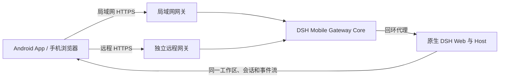

<p align="center">
  
</p>

<h1 align="center">DSH Mobile</h1>

<p align="center">在手机上安全、实时地使用电脑中的 DeepSeek Harness。</p>

<p align="center">
  <a href="https://www.npmjs.com/package/dsh-mobile"></a>
  <a href="https://www.npmjs.com/package/dsh-mobile"></a>
  <a href="https://github.com/saya-ch/dsh-mobile/actions/workflows/ci.yml"></a>
  <a href="https://github.com/saya-ch/dsh-mobile/releases"></a>
  <a href="LICENSE"></a>
  <a href="https://github.com/awesome-dsh-plugin/awesome-dsh-plugin"></a>
</p>

<p align="center">
  <a href="#能做什么">能做什么</a> ·
  <a href="#快速开始">快速开始</a> ·
  <a href="#连接教程">连接教程</a> ·
  <a href="#扩展与自定义">扩展与自定义</a> ·
  <a href="#设备管理">设备管理</a> ·
  <a href="#第三方插件适配">第三方插件适配</a> ·
  <a href="#安全">安全</a> ·
  <a href="#兼容性">兼容性</a> ·
  <a href="#贡献者">贡献者</a> ·
  <a href="CHANGELOG.md">更新记录</a> ·
  <a href="README.en.md">English</a>
</p>

> DSH Mobile 是 DeepSeek Harness 社区插件，原生 App 仅支持 Android。
>
> **当前正式版本：0.6.3**。改善插件安装、移动输入栏与 DSH 新版适配，新增可选扩展 Worker 模式，并加强连接与数据可靠性。[更新记录](https://github.com/saya-ch/dsh-mobile/releases/tag/v0.6.3)。
>
> **版本说明**：自插件 **0.6.2** 起，Android App 与插件独立编号、独立发布，版本号无需一致；插件升级不代表 App 需要同步升级。[兼容说明](#兼容性)。

<p align="center">
  <a href="https://github.com/saya-ch/dsh-mobile/releases/download/android-v0.6.2/dsh-mobile-android-v0.6.2.apk"></a><br>
  <a href="https://github.com/saya-ch/dsh-mobile/releases/download/android-v0.6.2/dsh-mobile-android-v0.6.2.apk"><strong>下载 Android App 0.6.2</strong></a><br>
  <sub><a href="https://github.com/saya-ch/dsh-mobile/releases/tag/android-v0.6.2">版本说明与校验文件</a></sub>
</p>

DSH Mobile 是一个 DeepSeek Harness 插件，让手机浏览器或 Android App 通过局域网，或可选的 Tailscale Funnel、cpolar、cloudflared、自建 FRP 或自有反向代理远程通道连接电脑，继续使用同一份会话、工作区、消息和工具。电脑端分别启停局域网与远程访问、分别管理配对授权；Android App 统一显示已配对电脑。插件不修改 DeepSeek Harness 源码。

移动访问使用独立 HTTPS 与设备配对；Android App 固定局域网私有 CA，公开远程通道使用系统信任的证书；自签 FRP 入口还需由 0.4.6 App 在配对时固定远程 CA。

它还能在 DSH 对话里用 `/mobile <需求>` 定制手机端。

## 能做什么

- **在手机上继续电脑端的工作**：同一份会话、工作区、消息和工具，实时同步。
- **用对话定制手机端**：在 DSH 对话里提出布局、交互或功能需求；文件修改完成后，手机页面通常会自动刷新。
- **专属触屏布局**：会话抽屉、工具详情、设置、提问卡片和输入栏都按手机重新组织；App 跟随系统语言（简/英/意），插件界面跟随 DSH 语言。
- **多种远程通道**：Tailscale、cpolar、cloudflared 快速/命名隧道、自建 FRP、自有反向代理，按网络任选。
- **配对与多设备**：扫码、链接或密钥配对一次；切换 Wi-Fi、热点或 IP 后通常自动恢复；App 在一个列表中显示局域网和远程配对的电脑，定期检测可达状态，并支持切换、重新配对或删除本地记录。
- **一键诊断与放行**：检查版本、网关、网卡、防火墙和远程通道，生成脱敏报告；被拦截的第三方插件连接按确切路径一键放行。
- **任务系统通知**：任务完成与待输入以 Android 系统通知提醒，可在 App 内的 DSH“通用设置”中开启，锁屏文本脱敏。
- **纵深安全**：局域网固定私有 CA，公开远程入口使用受信任 HTTPS；自签 FRP 入口由 0.4.6 App 固定远程 CA。凭据存 Keystore，设备令牌只发往精确 Origin，第三方 WS 默认拦截。

配对设备可以操作电脑上的 DSH，应视为完全受信任的设备。局域网只在可信网络开启；远程访问应使用可靠的 HTTPS 通道。手机丢失时，请立即从电脑端撤销设备。

## 快速开始

先在电脑安装插件，再用 Android App 或手机浏览器配对。按你使用的 DSH 选择安装方式。

### 官方 DSH Desktop

在应用的 **插件** 页面安装并启用 `dsh-mobile`，再打开 **移动访问** 配置局域网或远程通道。Desktop 的 profile 由应用管理，不适用下面的 `--profile web` 命令。

安装或更新后，请从应用菜单正常退出并重新打开 Desktop，无需清除会话或配对数据。若仍提示 `dsh-mobile-question-fixes: failed to import`，请检查安装日志；这也可能是组件解析问题，单纯重启不一定能解决。

### DSH Web

已经安装 `dsh` 命令时，在终端执行：

```powershell
dsh plugin --profile web add dsh-mobile@latest
dsh plugin --profile web exec dsh-mobile setup
dsh --profile web
```

<details>
<summary>使用 DeepSeek Harness 源码或社区插件市场</summary>

在 DeepSeek Harness 源码目录中执行：

```powershell
pnpm install
pnpm dsh plugin --profile web add dsh-mobile@latest
pnpm dsh plugin --profile web exec dsh-mobile setup
pnpm dsh --profile web
```

也可以通过插件市场安装（可选）：

```powershell
dsh plugin --profile web add dshmarket
```

重启 DSH 后，在 **设置 → 插件市场** 里搜索 dsh-mobile 并安装。首次打开“移动访问”时，局域网页会列出电脑当前网络；确认网卡后由插件生成私有证书并配置局域网，按提示重启一次 DSH 即可使用，无需再打开终端运行 `setup`。

</details>

`setup` 会自动选择并记住当前局域网，切换 Wi-Fi、热点或 IP 后通常自动恢复；仅在自动选择失败时使用 `--address 192.168.x.x`。设置、证书、设备和自定义文件保存在 `$DSH_HOME/mobile-access/`。

### 安装手机 App

从上方链接下载正式 Android APK，或用手机浏览器打开电脑端生成的配对链接。随后按[连接教程](#连接教程)选择局域网或远程访问；手机不需要安装额外的隧道客户端。

通过 npm 安装的插件会在桌面界面加载时检查新版本，有更新时在访问面板标题右侧显示“更新插件”，安装后需重启 DSH。App 下载入口展示最新版本；本地开发包不会被自动覆盖，Android App 不会主动检查或推送版本更新。

## 连接教程

局域网和远程访问是两套相互独立的连接：在电脑附近优先使用局域网，延迟最低；离开当前网络时再启用远程访问。电脑端分别管理开关与配对授权；Android App 将所有已配对电脑集中显示在设备列表中。

### 局域网访问

适合同一 Wi-Fi、以太网或手机热点，是默认且最简单的连接方式。

<p align="center">
  
</p>

1. 让手机和电脑连接同一个局域网，在 DeepSeek Harness 左下角打开 **移动访问 → 局域网**。
2. 如果尚未开启，点击 **开启局域网访问**；随后点击 **生成并复制密钥**，面板会显示配对二维码。
3. 在 Android App 中进入 **局域网访问**，扫描发现电脑并点击设备，再扫描二维码或粘贴配对密钥。
4. 配对完成后会建立持久设备信任。以后打开 App 会自动发现并连接，切换 Wi-Fi、热点或 DHCP 地址通常不需要重新配对。

端口说明：`dsh web --port` 修改 DSH Web 上游端口（默认 3080），插件会自动跟随；`dsh-mobile setup --port` 修改 Mobile HTTPS 监听端口（默认 3443），配对二维码会包含实际端口。

<details>
<summary>无界面主机、内网代理与额外来源网段</summary>

无图形界面的 Linux 主机，或通过局域网 IP / 反向代理打开 DSH Web 时，左下角 **移动访问** 管理口同样可用。管理 API 仍要求 TCP 对端是本机回环（例如本机 `socat` / 反向代理连到 `127.0.0.1`），不会把插件自己暴露到公网；浏览器 Host 可以是 `localhost`、RFC1918 或 IPv4 链路本地地址，公网 IP 和任意域名仍会返回 403。反向代理必须只对可信的本机或内网请求开放，不能把 `/api/mobile-access` 管理路径公开转发到互联网。手机走的独立 HTTPS 入口（默认 3443）仍是移动端界面，不会变成桌面管理口。

已有 WireGuard 等受控路由网络时，0.6.0 提供[额外可信网段](docs/TRUSTED_NETWORKS.md)。它只追加明确的来源 CIDR，不建立 VPN 或路由，也不自动改 Windows 防火墙。

</details>

不安装 App 也可以访问：点击 **复制配对链接**，在手机浏览器中打开。局域网使用私有证书，浏览器首次访问可能提示不受信任；只在确认这是自己的 DSH 网关后按浏览器指引继续。公开证书的远程入口不应出现证书警告，若出现请检查通道和证书，不要直接忽略。

手机浏览器中的配对和重新连接页面会按浏览器的 `Accept-Language` 显示简体中文、英文或意大利文；Android App 则跟随系统语言。DSH 内的插件控制面板继续跟随 DSH 当前语言。

### 远程访问

适合手机离开电脑所在网络后使用。远程访问默认关闭，手机不需要另外安装 Tailscale、cpolar、cloudflared 或 FRP。

远程服务可能受带宽和连接限额影响：[cpolar 免费方案](https://svip.cpolar.com/pricing) 当前为 1 Mbps，[Tailscale Funnel](https://tailscale.com/docs/features/tailscale-funnel#requirements-and-limitations) 也存在不可配置的带宽限制，cloudflared 的 quick tunnel 由 Cloudflare 免费提供、地址随机且有限流。DSH Mobile 使用静态资源 gzip、WebSocket 长连接和顶部按需加载改善体验；会话的历史窗口与分页大小由 DSH 决定，插件无法提高服务商限额。

页面能打开但一直“重连中”，应先区分 WebSocket 升级失败、慢速数据同步和心跳超时，操作见[慢链路与反复重连指南](docs/SLOW_CONNECTIONS.md)。0.5.4 还提供按确切路径启用的 WebSocket 压缩，默认关闭；长会话或计量网络可按指南尝试，并对比实际传输量。

| 连接方式 | 需要准备 | 地址特点与注意事项 |
| --- | --- | --- |
| cpolar | cpolar 账号与 Authtoken | 国内网络可优先尝试；免费临时地址可能变化 |
| cloudflared 快速隧道 | 无需账号或域名 | 临时随机地址；不支持 SSE，[即时通知存在限制](docs/CLOUDFLARE_TUNNEL.md#快速隧道的功能限制) |
| cloudflared 命名隧道 | Cloudflare 账号与域名 | 固定域名；[配置指南](docs/CLOUDFLARE_TUNNEL.md) |
| Tailscale Funnel | Tailscale 登录与 Funnel 授权 | 中国大陆网络可能不稳定 |
| 自建 FRP | 已有 VPS，域名或真实公网 IPv4 | 需管理服务器；[部署](docs/SELF_HOSTED_FRP.md)或[接入既有 frps](docs/ATTACH_EXISTING_FRPS.md) |
| 自有反向代理 | 已有公开 HTTPS 代理 | 插件只提供私有认证后端；[配置指南](docs/SELF_HOSTED_ORIGIN.md) |

<p align="center">
  
</p>

1. 在 DeepSeek Harness 左下角打开 **移动访问 → 远程**，按上表选择通道，完成登录或配置。
2. 状态变为“远程访问已就绪”后，点击 **生成远程配对二维码**。自有反向代理仅显示“后端已监听”，仍需确认公网 HTTPS 与 WebSocket 可用。
3. 在 Android App 中选择 **远程访问**，扫描当前二维码完成配对；公开证书入口也可用手机浏览器打开配对链接。
4. 以后 App 使用保存的地址与凭据自动重连。临时地址改变时，重新扫描电脑端当前二维码验证新地址，不需要清除 App 数据；旧设备 token 不会发送给新 Origin。

<details>
<summary>各通道的安装与登录步骤</summary>

在面板选择对应通道后：
   - **Tailscale Funnel**：点击 **启用远程访问**，在打开的官方页面完成一次 Tailscale 登录；按面板提示继续允许 Funnel，然后返回 DSH 等待连接就绪。
   - **cpolar**：点击 **安装官方组件**，登录 cpolar 控制台取得 Authtoken，粘贴后点击 **保存并连接**。组件只会在确认后下载到插件私有目录；免费临时地址可能在 DSH 或 cpolar 重启后变化。
   - **自建 FRP（高级）**：已有 VPS 时，展开 **自建连接**，填写 frps 信息和公开 HTTPS 域名或真实公网 IPv4。可以复制受限的 frps + Caddy 模板手动部署，也可以在 Ubuntu/Debian + systemd 上用 SSH 密钥一键部署；不支持密码登录，也不会覆盖非 DSH Mobile 管理的 Caddy 配置。部署或清理前须到 VPS 控制台核对主机指纹。本机 `frpc` 按需下载校验，VPS 需单独清理。需要 Android App 0.3.3 或更新版本；证书、端口和操作步骤见 [自建 FRP 使用指南](docs/SELF_HOSTED_FRP.md)。
   - **自有反向代理**：展开 **自建连接 → 自有反向代理**，填写公网 HTTPS 地址（支持自定义端口）、私有监听 IPv4、独立 HTTP 后端端口（默认 3444）和代理来源 CIDR，再点击 **保存并启动后端**。适合已有 Lucky/Nginx/Caddy 的用户，无需隧道组件；需要 Android App 0.4.0 或更高版本。详见 [自有反向代理指南](docs/SELF_HOSTED_ORIGIN.md)。
   - **cloudflared 快速隧道**：点击 **安装官方组件**，插件在确认后从官方发布页下载固定版本到插件私有目录，随后自动申请一个临时公网地址（quick tunnel），**无需注册或登录**。适合不想注册账号的用户；quick tunnel 地址每次重连都会变化，官方定位为测试用途、有限流且无可用性保证，请勿用于必须长期可达的生产访问，只适合临时或验证场景。
   - **cloudflared 命名隧道**：已有 Cloudflare 账号和域名时，把隧道类型切到 **命名隧道**，填入连接器令牌、公网域名与本机转发端口，即可获得重启后不变的固定地址（令牌只存私有目录、只经环境变量传给 cloudflared）。步骤见 [Cloudflare 命名隧道](docs/CLOUDFLARE_TUNNEL.md)。

</details>

<details>
<summary>远程通知、服务器运维与安全限制</summary>

> **远程通知说明**：浏览器的 `Notification` 权限按 Origin 分别授权，网页系统通知只显示在运行该网页的设备上。Android App 的任务提醒是独立的 0.4.0 功能，需要在 App 内 DSH 的 **设置 → 通用设置** 中主动开启，且依赖 WebView 页面仍存活；它不是通用的后台推送。需要可靠的后台推送时，请使用你已配置的服务端 webhook 或机器人通道。

Tailscale Funnel 覆盖范围广，但在中国大陆网络下可能不稳定。其运行组件把公开监听生命周期绑定到父进程和受限控制通道；父进程退出、控制通道关闭或显式停止时会结束当前代次并清理资源。cpolar 更适合国内网络；自建 FRP 适合已有 VPS、希望避开公共服务带宽限制的用户。cloudflared 有两种模式：快速隧道不需要账号或登录，但地址随机、每次重连都会变化，[官方定位为测试用途](https://developers.cloudflare.com/cloudflare-one/networks/connectors/cloudflare-tunnel/do-more-with-tunnels/trycloudflare/)且无可用性保证，因此只适合临时或验证场景；命名隧道使用 Cloudflare 账号令牌，能保留重启后不变的固定公网域名。中国大陆 VPS 上的未备案域名可能被云厂商拦截，此时可使用公网 IPv4 模式。插件会校验按需下载的固定版本组件；本机托管的配置与程序保存在 `$DSH_HOME/mobile-access/`，可在面板中清理。VPS 侧的文件须按自建连接指南单独清理。

自建 FRP 的托管部署使用指向 DSH 回环网关的 HTTP vhost：VPS 上的明文 vhost 只允许回环访问，由 Caddy 提供公网 HTTPS。0.4.6 新增“接入既有 frps”，不会安装或改动服务器；公开 CA 档仍需受限 HTTP vhost 与 Caddy，自签档则用 frps TCP 透传至电脑端 HTTPS 网关，须由 0.4.6 Android App 在配对时固定 CA。自签档目前面向公网 IPv4，旧版 App 不支持；两档都不开放任意 FRP 配置。frps 的 `proxyBindAddr` 是全局代理监听设置，不能只为新增 TCP 入口调整而忽略已有明文 vhost。[接入指南](docs/ATTACH_EXISTING_FRPS.md)。

自有反向代理的 HTTP 后端只允许留在可信私网；**不要把它映射到公网，也不要绕过它直连 DSH 或现有 LAN 3443**。来源 CIDR 匹配代理的直接 TCP 来源，不信任转发头；反代须保留外部 Host（含端口）、Origin、Cookie 和 WebSocket。清除代理配置不会删除已配对远程设备。

各通道的系统和组件支持范围见[兼容性](#兼容性)。本机托管的程序、凭据与配置可从面板清理；VPS 上的文件必须按对应指南单独清理。

</details>

## 扩展与自定义

在 DSH 对话里输入 `/mobile <需求>`，当前会话的 agent 会处理定制请求；文件修改完成后，手机端通常会在几秒内刷新。例如：

```text
/mobile 把手机端做成老式终端的样子，让消息像终端输出一样逐行滚动
```

也可以让手机端调用电脑端的能力，比如实时读取电脑状态：

```text
/mobile 为手机端添加赛博朋克风格的电脑监控面板，实时显示电脑的 CPU、内存和磁盘占用
```

`/mobile` 把需求交给 DSH 对话中的 agent，由它直接修改本机 `$DSH_HOME/mobile-access/` 下的文件，保存后手机端自动生效。改动分两类：界面和交互在 `mobile.css`/`mobile.js`；需要电脑能力时用 `extensions/` 下的扩展，其 `host.mjs` 以本机用户权限在电脑上运行。不修改 DeepSeek Harness 源码。

扩展清单及其脚本、样式和资源按版本标识刷新。插件监听到 `/mobile` 或扩展文件变化后，会通过已认证连接通知手机立即更新；页面可见时每 45 秒、隐藏时每 5 分钟的检查只作为断线兜底。Host 暂存失败会继续使用现有版本；若 Host 已更新但新手机界面激活失败，则关闭该扩展并自动重试，避免混用新旧能力。

扩展动作的 `input` 可以直接使用 `api.schema.object(...)` 等 Schemastery schema，也可以使用带 `parse(value)` 的适配器；手机端 `api.host.invoke()` 会按 JSON 请求发送，输入会在电脑端动作执行前完成校验和规范化。

0.6.3 新增可选的 [Worker 执行模式](docs/EXTENSION_WORKERS.md)，用于约束可信本地扩展的 JavaScript 阻塞；默认关闭，按扩展选择，故障后显式恢复，不自动重放操作。这不是权限沙箱，也不要求 App 同步版本。

<sub>你甚至可以通过扩展连接电脑上运行的酒馆，并从同一 App 打开它的简易移动前端。</sub>

> `host.mjs` 与本机程序拥有相同权限；仅创建和运行你理解并信任的电脑端扩展。

示例的实际效果：

<p align="center">
  
  
  
  
</p>

## 设备管理

Android App 在“已配对设备”中统一显示电脑及其局域网／远程连接记录。两种方式的授权彼此独立，同一台电脑可能有两条记录。升级会迁移旧凭据，无需重新配对；重新验证变化的地址后，相同身份的记录会合并并保留名称。自签 FRP 使用独立 CA 指纹，可能另成一条记录。Token 和固定的 CA 由 Android Keystore 加密；配对二维码含短期配对信息，不含长期设备 Token 或 CA 私钥。

每条记录显示自定义名称、连接方式、Origin、定期更新的可达状态和最近连接时间。绿色状态点表示“可达”，灰色状态点表示“检测中”“暂不可达”“配对已过期”或“电脑端已移除”；可达性检查直接验证 DSH Gateway，不依赖 ICMP，也不会把暂时断网误判成电脑端撤销。

- **启动行为 → 直接进入 DSH**（默认）：单设备直接连接；多设备优先连接上次使用的设备，其次按最近连接时间选择仍有效的设备。连接超过有限重试预算后自动回到列表，不会无限转圈。
- **启动行为 → 显示设备列表**：每次启动先选择电脑，适合经常在多台设备之间切换。入口是列表右上角 **设置 → 启动行为**，修改后立即保存。
- 点按设备行可连接；右侧“…”和长按提供相同的操作面板，可编辑名称、立即检测、重新配对或删除本地记录。删除前会二次确认，并提供短暂撤销；撤销只恢复本机记录，不恢复电脑端已经撤销的授权。
- 在 WebView 页面打开 DSH **设置 → 通用设置 → 切换电脑** 可回到已配对设备列表。在线收到电脑端撤销通知后，App 保留条目并显示“电脑端已移除”，停止自动重连，提供重新配对和删除本地记录。
- **0.6.0 新增**：列表保持固定顺序，新配对追加到末尾，升级保留旧版可见顺序；操作面板提供 **上移／置顶**，顺序与启动选择分开。App 内还可长按左上角抽屉开关返回列表，短按仍开关抽屉；手机浏览器没有此原生动作。

电脑端撤销会永久删除持久化存储中的设备记录及令牌摘要，而不是保留 `revokedAt` 标记；启动时也会清理旧版留下的已撤销记录。删除后，旧令牌与未知令牌一样返回 `401 authentication_failed`。现有 App 若在离线期间被撤销，再次检测时可能显示“配对已过期”，需要重新配对；在线会话仍会收到撤销通知并立即断开。

<table>
  <tr>
    <td align="center" valign="top" width="50%">
      <br>
      <sub>设备管理列表：查看已配对电脑、连接方式和可达状态</sub>
    </td>
    <td align="center" valign="top" width="50%">
      <br>
      <sub>启动行为设置：选择直接进入 DSH 或显示设备列表</sub>
    </td>
  </tr>
</table>

## 第三方插件适配

0.5.3 包含默认启用、可独立启停的 `dsh-mobile-question-fixes` 提问卡片组件。在 DSH 插件详情的组件列表中关闭它，可立即恢复原卡片样式。长问题、选项和底部按钮在有限高度的卡片内共同滚动，收起时标题最多显示两行；手机浏览器的触屏 Enter 保留换行，Android App 则仅在软键盘已打开且未连接实体键盘时使用该行为。答案草稿仍由 DSH 管理，不另存到浏览器 localStorage。

DSH Mobile 保留工作区、任务管理、终端和文件面板入口，第三方插件仍由 DSH 加载。移动层适配布局与连接，不修改 DeepSeek Harness 源码；具体插件在小屏上是否易用，仍取决于它自身的布局与交互。

第三方插件需要能在 DSH Web 页面中运行，并使用可达的 HTTP／WebSocket 接口。移动层不保证把所有插件的自定义布局自动改成手机布局，也不能替代插件依赖的桌面原生窗口。

### WebSocket 放行

- 网关默认只允许 DSH 内置的第一方 WebSocket 路径，包括 `/sidebar/ws/terminal`。社区侧边栏插件使用的其他路径默认拦截，通常会在诊断页显示为待处理项目；截图中的 `/sidebar/ws/agent-opens` 和 `/sidebar/ws/agent-terminals` 就属于这类需要按实际插件确认的路径。
- 在 **连接诊断 → 第三方 WebSocket 路径** 中，只对确认过的精确路径点击 **允许**。系统不接受带查询字符串或模糊前缀的路径；不建议使用“全部允许”。已允许的路径可以随时移除，局域网和远程连接使用同一套规则。
- 放行只代表该路径可以通过已认证、同源的 DSH Mobile 网关，不会开放任意 TCP/UDP 端口，也不会绕过设备配对。若社区插件仍然连接失败，先看诊断页的实际拦截路径，再按一条路径放行。

若另一个远程访问插件在 DSH Mobile 页面上显示自己的“未配对”提示，那是两套不同的授权。可先在电脑端暂时关闭另一插件的远程访问，确认 Mobile 链路是否恢复；不要把 DSH Mobile 密钥输入它的配对页。仅用下面的模块排除选项不能保证移除该插件在页面启动前注入的请求改写脚本，参见 [#111](https://github.com/saya-ch/dsh-mobile/issues/111)。

网关允许部分 HTTP iframe 不代表客户端会加载它：内容未加密，Android App 仍阻止 HTTPS 页面中的 HTTP 混合内容，浏览器也可能拦截。请优先配置 HTTPS；通过 HTTPS 管理入口打开远程面板时会显示相同风险提醒。

### 可选模块与高级配置

0.6.0 新增[移动页面模块设置](docs/CLIENT_MODULES.md)，可分别设置电脑默认和当前设备选择，不卸载电脑插件。保存后下次手动打开生效，不自动刷新会话；已保存选择失效时提供恢复入口。

<details>
<summary>通过 profile 配置 excludedClientModules</summary>

若某个不需要的客户端插件显著增加手机首次加载流量，高级用户可在当前 profile 的 `mobile-access` 插件配置中设置 `excludedClientModules`，填入启动清单中的**准确包名**，重启 DSH 后生效。它只改变经网关提供的专用移动页面；电脑端和 `?frontend=stock` 页面不变。例如，若当前启动清单同时包含以下两个包，下面的配置会移除文档预览及依赖它的“在应用中打开”功能：

```yaml
excludedClientModules:
  - '@deepseek-ai/dsh-client-ui-sidebar-documentpreview'
  - '@deepseek-ai/dsh-client-ui-open-in-app'
```

这是按安装环境选择的高级配置，没有默认排除列表。插件会拒绝不存在的包、启动必需模块，以及仍被保留模块通过 `inject` 或 `external` 引用的包；配置不匹配当前 DSH 或社区插件时，移动页面返回 `409 excluded_client_modules_invalid` 和冲突详情，电脑端也会提示，移除或调整配置即可恢复。模块内容与依赖会随 DSH 版本变化，不能把其他人的节省比例当作自己的预期。

设置优先级为本设备选择 → 电脑默认 → 插件配置。详细生效与恢复规则见[模块指南](docs/CLIENT_MODULES.md)。

</details>

<table>
  <tr>
    <td align="center" valign="top" width="50%">
      <br>
      <sub>Android App 下社区侧边栏插件的兼容</sub>
    </td>
    <td align="center" valign="top" width="50%">
      <br>
      <sub>连接诊断：检查第三方 WebSocket 路径并按需放行</sub>
    </td>
  </tr>
</table>

## App 与手机浏览器

| 方式 | 适合场景 | 说明 |
| --- | --- | --- |
| Android App | 日常使用 | 首次配对时分别提供局域网与远程入口；局域网自动发现，公开远程证书由系统验证，自签 FRP 入口由 App 固定 CA |
| 手机浏览器 | 临时或跨平台访问 | 打开“移动访问”卡片显示的 HTTPS 地址；局域网私有证书可能需要手动确认，公开远程证书不应出现警告 |

Android App 只是 Kotlin WebView 薄壳，不内置另一份网页；手机浏览器访问的是同一页面。需要排查兼容性时，可在浏览器地址后追加 `?frontend=stock`，临时回到旧的桌面页面适配模式。

0.5.5 的专用移动页面会在 DSH 的第一个启动脚本之前，同步加载经网关鉴权的同源 `/mobile-access/compat.js`，为缺少 `Iterator` / Iterator helpers 的 WebView 提供随插件打包的 core-js 兼容实现，避免启动时出现 `Iterator is not defined`。兼容层按能力检测保留或修正原生 helper，不依赖 CDN，也不会放宽 CSP；桌面页面与 `?frontend=stock` 页面不会加载这个网关脚本。

0.6.0 在同一个启动前脚本中增加 `Promise.withResolvers` 与 `AbortSignal.any` 的能力检测和兼容实现。Android App 还会在支持 document-start 注入的 WebView 中，为配对的精确 Origin 提前补齐 `Promise.withResolvers`。这只覆盖已识别的缺失 API，不是所有旧内核的支持承诺；前端仍以 ES2022 为构建目标，尚未在报告中的华为 WebView 114 真机上验收。出现其他兼容错误时，若设备允许更新，请优先更新 Android System WebView / Chrome；若系统组件不可更新，请保留完整错误、内核版本与进入方式供排查。

> **社区客户端（非官方）**：[微信小程序客户端](https://github.com/StrawberryAO/dsh-mobile-minapp)
> 原生微信小程序实现，复用「移动访问」的配对与 Remote 流协议（需 dsh-mobile ≥ 0.3.8）。
> 因微信正式版强制「合法域名」（需 ICP 备案的自有 HTTPS 域名），目前需通过微信开发者工具 / 真机调试使用，详见其 README。

## 工作原理


```mermaid
flowchart LR
  Phone["Android App / 手机浏览器"] -->|"局域网 HTTPS"| Lan["局域网网关"]
  Phone -->|"远程 HTTPS"| Remote["独立远程网关"]
  Lan --> Gateway["DSH Mobile Gateway Core"]
  Remote --> Gateway
  Gateway -->|"回环代理"| DSH["原生 DSH Web 与 Host"]
  DSH -->|"同一工作区、会话和事件流"| Phone
```

插件包含三层：Host face 负责发现、配对、HTTPS、回环代理和扩展注册表；Client face 提供独立的移动布局与扩展 SDK；Android App 提供受限的原生 Bridge。Bridge 使用 `androidx.webkit` WebMessage，每条消息都校验精确顶层 Origin 和主 Frame，并限制消息大小；不使用 `addJavascriptInterface`。DeepSeek Harness 的源码和当前 Web 页面（默认端口 3080，可通过 `dsh web --port` 修改）都不会被改动，安装和卸载完全通过插件机制完成。

## 安全

- 局域网监听只用于可信家庭、办公网络或可信热点；不要自行做端口转发。
- 远程地址可从公网到达，但未配对请求无法进入 DSH；不使用时应关闭远程开关。
- cpolar 仅在用户确认后下载固定官方版本并校验大小和 SHA-256；不会安装系统服务、写入 PATH 或设置开机启动，插件清理会删除其托管文件。
- cloudflared 同样仅在用户确认后从官方 GitHub Release 下载固定版本并校验精确大小和 SHA-256，且启动时关闭自动更新，以保证运行的始终是已校验的那份二进制；快速隧道不需要账号、Token 或 DNS 记录；命名隧道令牌只存插件私有目录、只经环境变量传给 cloudflared，清理时删除插件托管的全部文件。
- 自建 FRP 仅在用户确认后从官方 Release 下载固定版本 `frpc`，校验来源、精确大小、SHA-256、压缩包路径和可执行文件版本；共享 Token 不会出现在状态、诊断或接入清单响应中。复制服务器模板，或重新输入 Token 后显式复制含 Token 的接入配置时，它会进入系统剪贴板，请粘贴后及时清除。本机清理只删除插件管理的文件；托管部署的 VPS 需用面板卸载脚本或一键清理单独清除，接入既有 frps 则不会改动或清理你的 VPS。自动部署与一键清理前都需核对 SSH 主机指纹。
- 配对设备拥有控制电脑端 DeepSeek Harness 的能力，应视为完全可信设备；丢失手机后应在电脑端撤销设备。
- 移动网关以 DSH 本机操作者身份代理请求，支持普通插件路由的 `GET`、`HEAD`、`POST`、`PUT`、`PATCH`、`DELETE`；写请求仍校验配对 Session、精确 Origin 与 CSRF。第三方插件不能把上游回环 Host 当成请求来自电脑物理本机的证明。
- 移动网关开启时才监听局域网；关闭后 DeepSeek Harness 仍正常在电脑本机运行。

完整说明见 [SECURITY.md](SECURITY.md)。

## 故障排查

- **配对成功后仍反复提示重新配对或续期 `401`**：同一域名上的其他服务或旧 Cookie 可能干扰认证。更新至最新插件及 App，再从当前移动访问入口重试；浏览器重新扫描当前二维码可更新本插件的认证 Cookie，无需清除所有网站数据。若仍失败，查看失败请求与脱敏日志，其他认证或代理错误也可能返回 `401`。
- **内测声明无法确认或设置无法保存**：先在电脑端直接打开 DSH 的本机地址，查看终端日志或浏览器 Network 中失败的设置请求。连接诊断不检查设置写入；保留现有配置及 `settings.yaml.imported`，按具体错误排查。相同界面提示可能有不同原因，见 [DSH #860](https://github.com/deepseek-ai/deepseek-harness/discussions/860)。
- **设置请求返回 HTTP `403`**：先检查 DSH 的 Host/Origin 信任校验及代理响应。检查 iframe、代理和浏览器扩展是否改变请求来源，使用本机直接访问验证；保持信任检查启用。
- **错误包含 `profile reload requires the root Include entry`**：该错误发生在 DSH 重载 profile 时。[Issue #132](https://github.com/saya-ch/dsh-mobile/issues/132) 报告过加载两份 `dsh-app-boot` 导致此错误，但单凭提示不能确认原因。核对实际运行的 DSH 命令与当前 profile 的版本和安装路径，保留配置并按 [DSH 官方文档](https://deepseek-harness.github.io/deepseek-harness/)修复依赖；仍失败时将版本、模块路径及脱敏后的完整错误提交上游。
- **设置错误包含 `EACCES`、`EPERM` 或锁文件操作失败**：检查报错文件的权限及启动环境注入的文件操作工具。锁清理失败也可能发生在写入之后，先核对实际保存结果。
- **手机出现另一插件的“输入配对码”页面**：`dsh-remote-web-ui` 与 DSH Mobile 各有独立的远程通道和配对码，不能交叉使用。若电脑端连接诊断提示“第三方远程插件”，先关闭该插件的远程访问并刷新，再扫描 DSH Mobile 当前二维码。仅安装该插件而未启用它的远程接管，不会触发这条诊断。
- **远程诊断显示“电脑经代理可访问”**：诊断先直连，失败后才尝试 DSH 进程环境变量中的 HTTP 代理；`NO_PROXY` 可排除目标。此结果只说明电脑经代理完成 HTTPS 探测，不代表手机或实际隧道可用。请用手机流量实际连接；若直连和代理都失败，报告仍为不可达，不会把离线误报为就绪。
- **切换网络后局域网访问不可用**：如果日志提示 `saved LAN interface "XXX" is not connected`，表示保存的网卡当前未连接。DSH 会继续运行，移动访问暂时休眠，原网卡恢复后会自动重试；若已改用新网卡，请重新完成局域网配置或重跑 `setup`。暂时不用移动访问时，可以在 `cordis.patch.yml` 中禁用 `mobile-access`。

## 兼容性

下表记录已验证的 DSH 与插件版本组合，不表示其他版本自动兼容。0.3.6 起插件不会仅凭版本号拒绝启动；升级 DSH 后若遇到移动端异常，请先核对兼容表并更新插件。历史记录见 [CHANGELOG.md](CHANGELOG.md)。

0.5.2 保留 DSH 宿主依赖名称，但不按 DSH 版本号拦截安装。新版本仍需经过下方的源码契约与配对启动检查；不在表中的版本不代表已验证。

### 系统支持矩阵

| 通道 | Windows x64 | Linux x64 | Linux arm64 | macOS |
| --- | --- | --- | --- | --- |
| 局域网 | 支持（自动配防火墙） | 支持（防火墙自理） | 支持 | 支持 |
| Tailscale Funnel | 支持（随包提供） | 支持（随包提供） | 支持（随包提供） | 不支持 |
| cpolar | 支持（按需下载） | 支持（按需下载） | 支持（按需下载） | 不支持 |
| cloudflared 快速/命名隧道 | 支持（按需下载） | 支持（按需下载） | 支持（按需下载） | 支持 x64/arm64（按需下载） |
| 自建 FRP | 支持（按需下载） | 支持（按需下载） | 支持（按需下载） | 支持（按需下载） |
| 自有反向代理 | 支持（纯配置） | 支持（纯配置） | 支持（纯配置） | 支持（纯配置） |

macOS 上局域网、cloudflared、自建 FRP 与自有反向代理可用；Funnel 与 cpolar 暂未提供 macOS 组件。诊断页的防火墙检查目前仅覆盖 Windows，其他系统显示“不适用”。

| DSH Mobile 插件                         | 验证支持的 DeepSeek Harness 版本                             |
| ----------------------------------------- | -------------------------------------------------------------- |
| `0.5.5` | `0.1.7-alpha.2`、`0.1.7-rc.1`、`0.1.7-rc.2`、`0.2.0-rc.1`、`0.2.0-rc.2`（npm 打包安装、隔离配对、移动页面启动及 WebSocket 工作区读取） |
| `0.6.0` | `0.1.7-alpha.2`、`0.1.7-rc.1`、`0.1.7-rc.2`、`0.2.0-rc.1`、`0.2.0-rc.2`（打包安装、配对、移动页面启动与 WebSocket 工作区读取）；另验证移动输入栏、模块设置及官方 Desktop 正常重启后的组件加载 |
| `0.6.2` | `0.2.0-rc.2` 的打包旧 WebView 启动、触屏滚动与缺失 API／视口负对照通过；发布 CI 通过。未将 #187 报告者的实际旧设备写成已验收 |
| `0.6.3` | `0.2.0-rc.2`、`0.2.1-alpha.2`（打包安装、隔离配对、移动页面与 WebSocket 工作区读取）；另验证输入栏、设置与扩展 Worker 的超时、流式传输和显式恢复 |

<details>
<summary>历史版本验证记录</summary>

| DSH Mobile 插件 | 验证支持的 DeepSeek Harness 版本 |
| --- | --- |
| `0.5.4` | `0.1.7-alpha.2`、`0.1.7-rc.1`、`0.1.7-rc.2`、`0.2.0-rc.1`、`0.2.0-rc.2`（npm 打包安装、隔离配对、移动页面启动及 WebSocket 工作区读取） |
| `0.5.3` | `0.1.7-alpha.2`、`0.1.7-rc.1`、`0.1.7-rc.2`、`0.2.0-rc.1`、`0.2.0-rc.2`（源码契约、npm 打包安装、隔离配对、移动页面启动及 WebSocket 工作区读取） |
| `0.5.2` | `0.1.7-alpha.2`、`0.1.7-rc.1`、`0.1.7-rc.2`、`0.2.0-rc.1`（延续既有验证）；`0.2.0-rc.2`（源码契约、隔离配对、移动页面启动和 WebSocket 工作区读取） |
| `0.5.1` | `0.1.7-alpha.2`、`0.1.7-rc.1`、`0.1.7-rc.2`、`0.2.0-rc.1`；官方 Desktop `0.1.7-rc.2`（桌面管理入口） |
| `0.5.0` | `0.1.7-alpha.2`、`0.1.7-rc.1`、`0.1.7-rc.2`；官方 Desktop `0.1.7-rc.2`（桌面管理入口） |
| `0.4.7` | `0.1.7-alpha.2`、`0.1.7-rc.1`、`0.1.7-rc.2`（源码契约、隔离配对及 WebSocket 工作区读取） |
| `0.4.6` | `0.1.7-alpha.2`、`0.1.7-rc.1`（源码契约、隔离配对及 WebSocket 工作区读取） |
| `0.4.5` | `0.1.7-alpha.2`（源码契约检查、本机局域网及远程网关联调） |
| `0.4.4` | `0.1.6-alpha.2`（本机源码与 renderer-v2 契约检查） |
| `0.4.3` | `0.1.6-alpha.2`（本机源码与 renderer-v2 契约检查） |
| `0.4.2` | `0.1.6-alpha.1`（本机源码与 renderer-v2 契约检查） |
| `0.4.1` | `0.1.6-alpha.1`（本机源码与 renderer-v2 契约检查） |
| `0.3.15`、`0.3.16`、`0.4.0` | `0.1.5-rc.2`（契约检查）；`0.1.5-rc.1`（@idoall 局域网实测） |
| `0.3.14`                                | `0.1.3-alpha.2`                                              |
| `0.3.9`-`0.3.12`                        | `0.1.3-alpha.1`                                              |
| `0.3.6`-`0.3.8`                         | `0.1.2-rc.1`                                                 |
| `0.3.4`、`0.3.5`                        | `0.1.2-alpha.2`                                              |
| `0.3.0`-`0.3.3`                         | `0.1.2-alpha.1`                                              |
| `0.1.4`、`0.2.x`                        | `0.1.1-rc.2`                                                 |

</details>

现有 App（0.3.3 及更新）无需重新配对；cpolar 用户应使用 0.3.15 或更新 App，较早版本可能在免费线路的慢速首次加载完成前超时；更早的 App 还使用不同的状态栏策略。App 0.4.0 才支持多设备列表、启动行为设置和电脑端撤销状态同步；旧版 App 仍可连接已保存的单台设备。App 0.1.3 及更早版本需卸载重装并重新配对。

Android App 当前正式版为 0.6.2（build 78），新增页面缩放，改善系统区域处理与加密设备记录的可靠性；包名、签名及配对／续期协议保持兼容，已有配对无需重建。插件和 App 的版本号不要求相同；连接按协议及最低版本要求检查，具体原生功能另有要求时会说明所需 App 版本。

GitHub Release 的正式 APK 使用固定签名，可从同一签名的旧正式版原位升级并保留配对。自行构建的 Debug APK 若使用不同签名，不能直接覆盖安装正式版；切换前请准备重新配对。

## 卸载

以下是 Web profile 的两种卸载方式，按需选择其一；官方 DSH Desktop 请在应用的 **插件** 页面卸载。仅卸载插件不会删除 `$DSH_HOME/mobile-access/` 中的证书、配对记录或自定义文件。

仅卸载插件、保留本机数据：

```powershell
dsh plugin --profile web remove dsh-mobile
```

若要连同本机数据一起清理，请先备份需要保留的扩展与自定义文件，**先运行 `purge --yes`，再卸载插件**；不要先执行上面的单独卸载命令。`purge` 会删除整个 `$DSH_HOME/mobile-access/` 目录及插件创建的 Windows 防火墙规则，但不会清理 VPS 上的文件。

```powershell
dsh plugin --profile web exec dsh-mobile purge --yes
dsh plugin --profile web remove dsh-mobile
```

源码模式把上述 `dsh` 换成 `pnpm dsh`。

## 贡献者

感谢提交 PR、复现问题和提出建议的社区成员。[贡献者名单](CONTRIBUTORS.md)按已合并 PR、后来吸收的 PR 工作和 issue 反馈分别致谢；GitHub 右侧的 Contributors 区域由进入默认分支的提交自动生成，不能手动加入仅反馈问题的成员。

## 开发

```powershell
npm ci
npm run verify
```

文档快速检查使用 `npm run check:docs`。按改动选择的浏览器测试、隔离 DSH 打包验收、截图和正式发布流程见 [CONTRIBUTING.md](CONTRIBUTING.md)；Android 构建见 [App 手册](apps/mobile/README.zh-CN.md#构建)。不要用真实用户配置或正式 App 数据替代测试资料。

Apache-2.0，详见 [LICENSE](LICENSE)。
